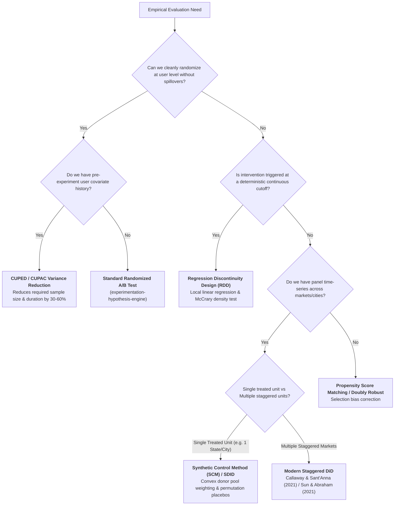

# Causal Inference, Quasi-Experimentation, & Variance Reduction

In modern technology organizations (Airbnb, Uber, DoorDash, Stripe), standard user-level randomized A/B testing is frequently impossible due to two-sided marketplace dynamics, network spillovers, local regulatory rollouts, or clustering constraints. Causal inference provides rigorous econometric and statistical identification strategies to measure true incremental treatment effects $\tau$.

---

## 1. The Causal Hierarchy of Methods

---

## 2. Mathematical Formulations & Identification Invariants

### 1. CUPED (Controlled-experiment Using Pre-Experiment Data)
- **Objective**: Remove explainable variance using pre-experiment metric $X$ to increase statistical power without bias.
- **Transformed Metric**:
  $$\tilde{Y}_i = Y_i - \theta^* (X_i - E[X])$$
  $$\theta^* = \frac{\text{Cov}(Y, X)}{\text{Var}(X)}$$
- **Variance Reduction**:
  $$\text{Var}(\tilde{Y}) = \text{Var}(Y)(1 - \rho^2)$$
  where $\rho = \text{Corr}(Y, X)$.
- **Sample Size Multiplier**:
  $$N_{\text{cuped}} = N_{\text{standard}} \times (1 - \rho^2)$$
  *Example*: If $\rho = 0.75$, variance drops by $56.25\%$, allowing the experiment to reach statistical significance in less than half the duration.

---

### 2. Difference-in-Differences (DiD) & Staggered Rollouts
- **Classic 2x2 Model**:
  $$Y_{it} = \beta_0 + \beta_1 \text{Treat}_i + \beta_2 \text{Post}_t + \delta (\text{Treat}_i \times \text{Post}_t) + \epsilon_{it}$$
- **Parallel Trends Assumption**:
  $$E[Y_{it}(0) - Y_{i,t-1}(0) \mid \text{Treat} = 1] = E[Y_{it}(0) - Y_{i,t-1}(0) \mid \text{Treat} = 0], \quad \forall t > T_0$$
- **Dynamic Event Study Specification**:
  $$Y_{it} = \alpha_i + \lambda_t + \sum_{k = -K, k \neq -1}^{L} \delta_k \mathbf{1}(t - E_i = k) + \epsilon_{it}$$
  *Invariant Check*: All pre-treatment coefficients $\delta_k$ ($k < -1$) must be statistically indistinguishable from zero ($p > 0.10$).
- **Staggered Adoption Rule**: Never use canonical Two-Way Fixed Effects (TWFE) with staggered timing due to negative weighting (Goodman-Bacon 2021). Use **Callaway & Sant'Anna (2021)** group-time average treatment effects $ATT(g, t)$ using clean never-treated or not-yet-treated controls.

---

### 3. Synthetic Control Method (SCM) & Synthetic DiD (SDID)
- **Objective**: Construct an artificial counterfactual for a treated unit $j=1$ using a weighted combination of untreated donor units $j=2, \dots, J+1$.
- **Constrained Optimization**:
  $$W^* = \arg\min_W (X_1 - X_0 W)' V (X_1 - X_0 W) \quad \text{subject to } w_j \ge 0, \sum_{j=2}^{J+1} w_j = 1$$
- **Placebo Permutation Tests**:
  - *In-Space Placebo*: Iteratively compute the post/pre RMSPE ratio for all donor units:
    $$r_k = \frac{\text{RMSPE}_{k, \text{post}}}{\text{RMSPE}_{k, \text{pre}}}$$
  - Exact $p$-value: $p = \frac{1}{J+1} \sum_{k=1}^{J+1} \mathbf{1}(r_k \ge r_1)$.
- **Synthetic DiD (Arkhangelsky et al., 2021)**: Combines SCM unit weights $\omega_i$ with time weights $\lambda_t$ and two-way fixed effect intercepts $\alpha_i, \beta_t$, relaxing SCM's strict convex hull requirements.

---

### 4. Regression Discontinuity Design (RDD)
- **Sharp RDD**: Treatment assignment jumps deterministically at cutoff $c$: $D_i = \mathbf{1}(X_i \ge c)$.
- **Local Treatment Effect**:
  $$\tau_{\text{RDD}} = \lim_{x \downarrow c} E[Y_i \mid X_i = x] - \lim_{x \uparrow c} E[Y_i \mid X_i = x]$$
- **Mandatory Diagnostic Battery**:
  1. **McCrary / CJM Density Test**: Verify density of running variable $f(X)$ is smooth at cutoff $c$ to rule out sorting or gaming.
  2. **Covariate Balance**: Pre-treatment covariates must exhibit zero discontinuous jumps at cutoff $c$.
  3. **CCT Optimal Bandwidth**: Use Calonico, Cattaneo, & Titiunik (2014) data-driven MSE bandwidth $h^*$ and robust bias correction.

---

## 3. Method Selection Playbook for Tech Organizations

| Scenario | Recommended Causal Method | Primary Diagnostic Check |
| :--- | :--- | :--- |
| **Online randomized feature test with pre-history** | **CUPED** | Covariate balance across variants; $X$ measured strictly pre-trigger. |
| **Market/city-wide rollout (1-3 cities, e.g. Miami launch)** | **Synthetic Controls (SCM) / SDID** | In-space placebo test; pre-treatment RMSPE fit; SUTVA isolation. |
| **State-by-state staggered policy / pricing change** | **Callaway & Sant'Anna DiD** | Pre-trend event study $ATT(g, t) \approx 0$ for $t < 0$; no negative weights. |
| **Credit score / loyalty tier / algorithmic cutoff** | **Sharp/Fuzzy RDD** | McCrary density test; CCT local linear bandwidth; covariate continuity. |
