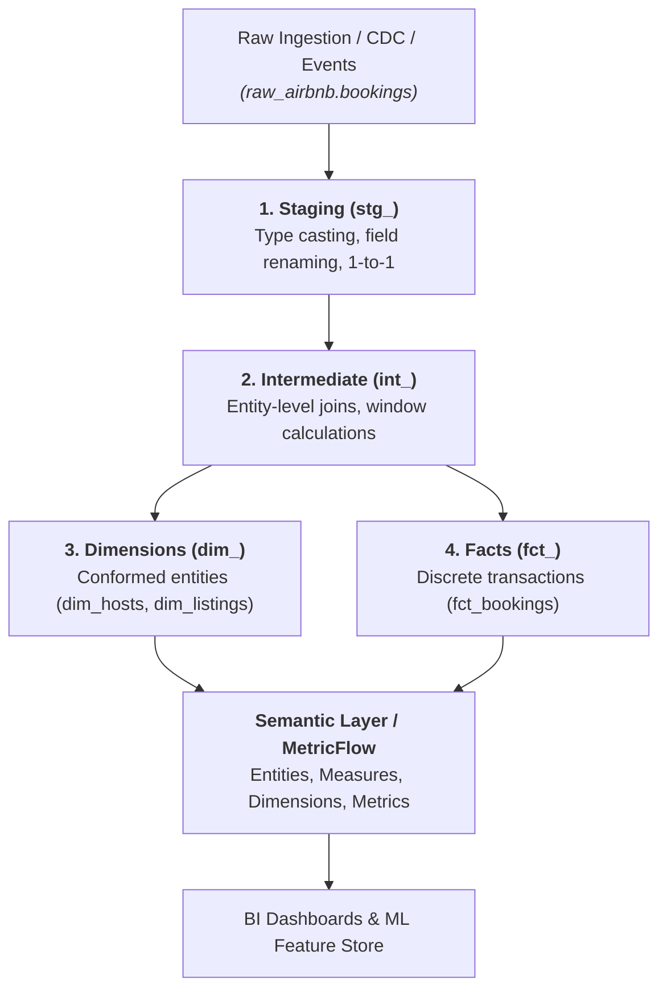

# Analytics Engineering, Dimensional Modeling, & Semantic Layers

In modern data stacks (Snowflake, BigQuery, ClickHouse, DuckDB, Databricks), reliable analytics requires structured dimensional modeling and semantic metric definitions.

---

## 1. The 4-Layer dbt Architectural Standard



---

## 2. Kimball Dimensional Modeling Rules

1. **Strict Grain Declaration**: Every fact table must explicitly state what one row represents (e.g. *One row per booking reservation event*).
2. **Surrogate Primary Keys**: Never use raw upstream string IDs as dimensional primary keys. Generate deterministic hash surrogate keys:
   ```sql
   {{ dbt_utils.generate_surrogate_key(['booking_id', 'version_id']) }} as booking_pk
   ```
3. **Conformed Dimensions**: Dimension tables (`dim_users`, `dim_listings`) must share identical definitions and surrogate keys across all fact tables.
4. **Additivity Standards**:
   - *Fully Additive Facts*: Can be summed across all dimensions (e.g., booking revenue, nights booked).
   - *Semi-Additive Facts*: Can be summed across some dimensions but not time (e.g., account balance, active listings count).
   - *Non-Additive Facts*: Ratios, unit prices, conversion percentages (must compute via Semantic Layer measures).

---

## 3. Data Contracts & Schema Enforcement Standard

Data contracts guarantee that upstream schema changes do not silently break analytics pipelines:

```yaml
version: 2
models:
  - name: fct_bookings
    description: "Discrete booking transactions at reservation grain."
    config:
      contract:
        enforced: true
      materialized: incremental
      unique_key: booking_pk
      incremental_strategy: merge
    columns:
      - name: booking_pk
        data_type: text
        constraints:
          - type: not_null
          - type: primary_key
      - name: guest_fk
        data_type: text
        constraints:
          - type: not_null
        tests:
          - relationships:
              to: ref('dim_users')
              field: user_pk
      - name: gross_booking_value_usd
        data_type: numeric(18, 2)
        constraints:
          - type: not_null
```

---

## 4. Semantic Layer & MetricFlow Specification

```yaml
version: 2
semantic_models:
  - name: bookings_semantic_model
    model: ref('fct_bookings')
    defaults:
      agg_time_dimension: booked_at
    entities:
      - name: booking_id
        type: primary
      - name: guest_id
        type: foreign
        expr: guest_fk
    dimensions:
      - name: booked_at
        type: time
        type_params:
          time_granularity: day
      - name: booking_status
        type: categorical
    measures:
      - name: total_gross_booking_value
        expr: gross_booking_value_usd
        agg: sum
      - name: distinct_booking_count
        expr: booking_id
        agg: count_distinct

metrics:
  - name: average_booking_value
    description: "Gross booking value per distinct booking."
    type: ratio
    type_params:
      numerator: total_gross_booking_value
      denominator: distinct_booking_count
```
