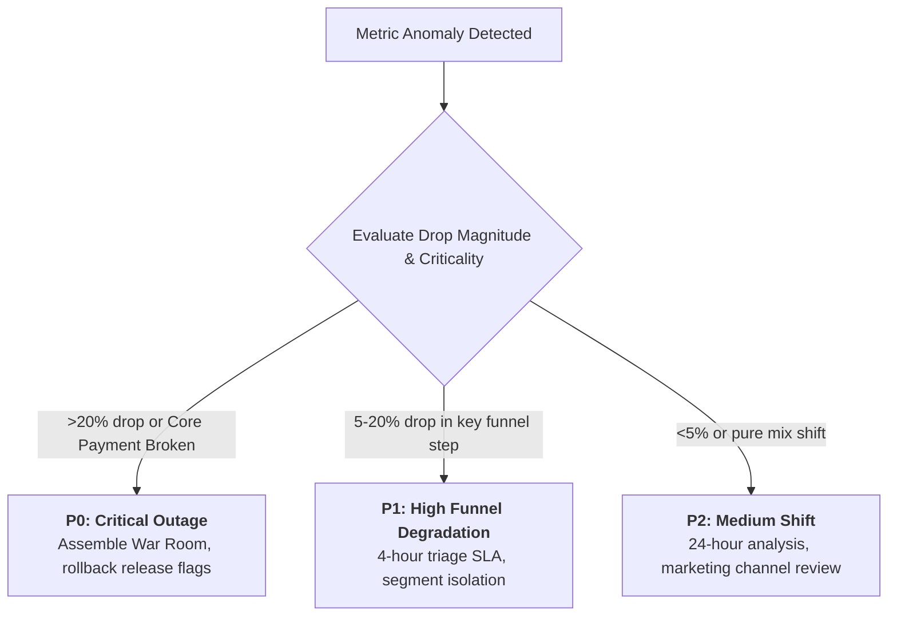

# Product Data Metric Investigation & Root-Cause Triage

When a core product KPI drops (e.g., Airbnb guest booking conversion drops from 3.2% to 2.7%), unstructured guessing wastes critical hours. Metric investigation requires mathematical variance decomposition, multi-dimensional waterfall slicing, and timeline correlation.

---

## 1. The 3-Factor Mathematical Variance Decomposition

Any aggregate rate metric $R = \frac{C}{V} = \sum_{i} w_i R_i$ (where $C$ is total conversions, $V$ is total visits, $w_i = \frac{V_i}{V}$ is segment traffic share, and $R_i = \frac{C_i}{V_i}$ is segment conversion rate) decomposes across time period 0 to 1 as:

$$\Delta R = R_1 - R_0 = \underbrace{\sum_{i} \Delta w_i \bar{R}_i}_{\text{Mix Shift Effect}} + \underbrace{\sum_{i} \bar{w}_i \Delta R_i}_{\text{Rate Effect}}$$

where $\bar{w}_i = \frac{w_{i,0} + w_{i,1}}{2}$ and $\bar{R}_i = \frac{R_{i,0} + R_{i,1}}{2}$.

```
┌─────────────────────────────────────────────────────────────────────────────┐
│                       METRIC VARIANCE WATERFALL                             │
├──────────────────────────────────────┬──────────────────────────────────────┤
│ 1. RATE EFFECT (True UX/Product)     │ 2. MIX SHIFT (Traffic Composition)   │
├──────────────────────────────────────┼──────────────────────────────────────┤
│ Conversion rate dropped within       │ Traffic shifted from high-converting │
│ segments (e.g. iOS Checkout broken). │ channel (SEO 5%) to low (TikTok 1%). │
└──────────────────────────────────────┴──────────────────────────────────────┘
```

---

## 2. Simpson's Paradox Detection

Simpson's Paradox occurs when every individual sub-segment improves, but the blended top-line metric declines because of a major shift in segment weights:

| Segment | Period 0 Visits | Period 0 Conv % | Period 1 Visits | Period 1 Conv % | Delta |
| :--- | :--- | :--- | :--- | :--- | :--- |
| **Desktop (High Conv)** | 8,000 (80%) | 4.0% | 2,000 (20%) | **4.5%** | **+0.5%** (Up) |
| **Mobile (Low Conv)** | 2,000 (20%) | 1.0% | 8,000 (80%) | **1.2%** | **+0.2%** (Up) |
| **Blended Top-Line** | 10,000 | **3.40%** | 10,000 | **1.86%** | **-1.54%** (Drop!) |

*Diagnostic Rule*: If $\Delta R_i > 0$ for all $i$ while $\Delta R < 0$, the issue is 100% **Mix Shift** driven by acquisition traffic composition, not a product degradation.

---

## 3. Triage Severity & Incident Protocol



---

## 4. Systematic 5-Step Investigation Sequence

1. **Data Freshness & Telemetry Integrity**: Verify event ingestion lag, schema drops, or tracking tag deletions before assuming user behavioral shifts.
2. **Mathematical Decomposition**: Calculate Mix Effect vs Rate Effect split.
3. **Multi-Dimensional Slice**: Run automated differential slicing across:
   - App Version / Build Hash
   - OS & Browser
   - Geographic Market / Country
   - Acquisition Source (Paid, SEO, Direct)
   - User State (New vs Returning, Logged in vs Guest)
4. **Timeline Event Cross-Referencing**: Overlay release deployments, feature flag flips, CDN outages, and marketing spend changes.
5. **Action Plan & Post-Mortem**: Document verified root cause, rollback/fix actions, and telemetry guardrails.
