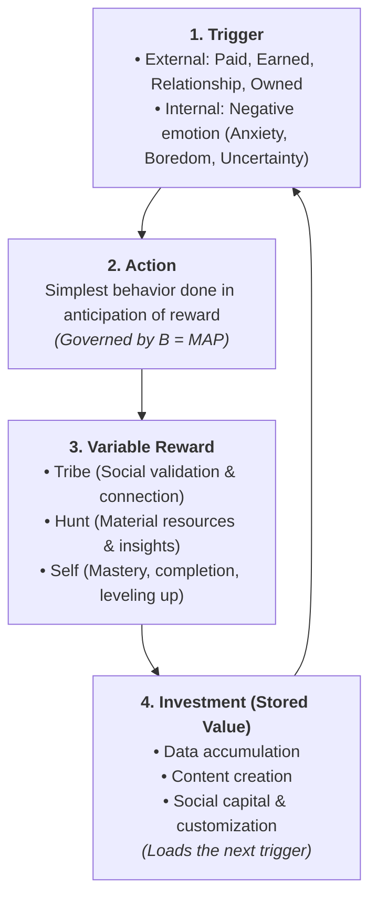

# Behavioral Loops, Fogg & Hook Models, & Retention Engineering

A world-class retention engine combines **BJ Fogg's behavioral mechanics** (how to trigger a single action right now) with **Nir Eyal's habit loops** (how to wire the action into a self-sustaining cycle) and **quantitative cohort analytics** (how to measure long-term compounding).

---

## 1. BJ Fogg's Behavior Model ($B = MAP$)

Behavior ($B$) occurs when **Motivation ($M$)**, **Ability ($A$)**, and a **Prompt ($P$)** converge simultaneously above the **Action Line**.

```
High ▲           /  (Action Line)
     │          /     ★ PROMPT SUCCEEDS (Behavior Happens)
 M   │         / 
 O   │        /
 T   │       /
 I   │      /
 V   │     /   ✕ PROMPT FAILS (Trigger ignored)
Low  ▼    /────────────────────────────────────────►
         Hard to Do ◄────────── ABILITY ──────────► Easy to Do
```

### The 3 Core Drivers of Motivation ($M$):
1. **Sensation**: Pleasure vs. Pain (immediate physical/emotional response).
2. **Anticipation**: Hope vs. Fear (expectation of a positive/negative future outcome).
3. **Belonging**: Social Acceptance vs. Rejection (need for status and tribe connection).

### Fogg's 6 Elements of Simplicity (Ability $A$):
Ability is about simplicity. To make a behavior radically easier, diagnose and remove friction across the 6 dimensions:
1. **Time**: Does the action take too many seconds/minutes?
2. **Money**: Does the action require financial commitment?
3. **Physical Effort**: Does the action require physical exertion or multi-device switching?
4. **Brain Cycles (Cognitive Load)**: Does the action require deep thinking, calculation, or decision fatigue?
5. **Social Deviance**: Does the action break social norms or make the user feel awkward?
6. **Non-Routine**: Does the action contradict established daily habits?

### The 3 Prompt Typologies ($P$):
* **Facilitator**: Used when Motivation is HIGH but Ability is LOW (simplifies the task; e.g., *"1-Click Apple Pay"*).
* **Spark**: Used when Motivation is LOW but Ability is HIGH (injects motivation; e.g., *"3 friends just joined"*).
* **Signal**: Used when Motivation is HIGH and Ability is HIGH (a gentle reminder; e.g., *"Your meeting starts in 2 min"*).

---

## 2. Nir Eyal's Hooked Model (Compounding Habit Loops)

While Fogg explains the discrete transaction, Eyal explains the **longitudinal habit formation cycle**:



### Phase 1: Triggers
* **External Triggers**: Scaffold early behavior (*Paid* ads, *Earned* PR, *Relationship* invites, *Owned* notifications).
* **Internal Triggers**: The ultimate goal of habit design. The user opens the product in response to an internal negative emotion/itch:
  - *Boredom* $	o$ YouTube, TikTok.
  - *Uncertainty / Fear of missing out* $	o$ Google, Twitter/X.
  - *Professional Anxiety* $	o$ Slack, Jira, Datadog.

### Phase 2: Action
* The minimal viable behavior ($B = MAP$). Optimize for the lowest cognitive load (e.g., Infinite Scroll on TikTok, 1-click search on Google).

### Phase 3: Variable Rewards (The Dopamine Engine)
Fixed rewards extinguish behavior; **variable rewards** stimulate compulsive dopamine activation:
1. **Rewards of the Tribe**: Social acceptance, upvotes, comments, peer recognition.
2. **Rewards of the Hunt**: Finding unexpected information, deals, gems, or critical alerts.
3. **Rewards of the Self**: Clearing inboxes (Inbox Zero), completing checklists, achieving mastery.

### Phase 4: Investment (Stored Value & Switching Costs)
The user puts something into the product that makes subsequent loops more valuable:
* **Data**: Financial records, analytics history, notes.
* **Content**: Playlists, repositories, document libraries.
* **Reputation**: Ratings, karma, seller reviews.
* **Skill**: Mastering hotkeys and advanced workflows.
* **Loading the Next Trigger**: Sending a message that prompts a reply notification.

---

## 3. Quantitative Cohort Retention & The "Aha Moment"

```
100% ┌────────────────────────────────────────────────────────┐
     │                                                        │
     │ ╲                                                      │
 50% │  ╲                                                     │
     │   ╲────────────────────► Flat Curve (Healthy SaaS)     │
     │    ╲                                                   │
 10% │     ╲                  ╲                               │
     │      ╲                  ╲──► Smiling Curve (Network)   │
  0% └───────┴──────────────────┴─────────────────────────────┘
      Day 0   Day 7    Day 30    Day 90
```

### The "Aha Moment" Inflection Formula:
$$	ext{Aha Milestone} = [X 	ext{ Core Value Actions}] 	ext{ within } [Y 	ext{ Days}]$$

* **Statistical Proof**:
  $$\Delta 	ext{Retention} = 	ext{Retention}_{	ext{Users who reached Aha}} - 	ext{Retention}_{	ext{Users who missed Aha}} \ge 40\%$$

| Product | Famous Aha Moment Formula | Behavioral Loop Mechanism |
| :--- | :--- | :--- |
| **Slack** | 2,000 team messages sent | Stored value: search history + internal trigger: unread notifications. |
| **Dropbox** | 1 file placed in 1 folder on 1 device | Fogg simplicity: zero cognitive load + automated syncing. |
| **Facebook** | 7 friends added in 10 days | Rewards of the Tribe + relationship triggers. |
| **Figma** | 1 project shared with >=1 collaborator | Multi-player investment + real-time feedback loops. |

---

## 4. The Ethical Manipulation Matrix

Evaluate the product's moral and psychological footprint:

| | User Life Materially Improved | User Life NOT Improved |
| :--- | :--- | :--- |
| **Creator Uses It** | **The Facilitator** (Gold Standard) | **The Peddler** (Self-delusion) |
| **Creator Does NOT Use It** | **The Entertainer** (Transient Art) | **The Dealer** (Exploitative Addiction) |
