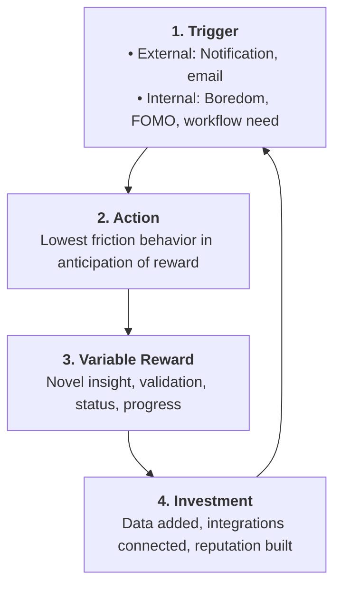

# Behavioral Loops & Cohort Retention Modeling Framework

## 1. The Anatomy of Cohort Retention Curves

```
100% ┌────────────────────────────────────────────────────────┐
     │                                                        │
     │ ╲                                                      │
 50% │  ╲                                                     │
     │   ╲────────────────────► Flat Curve (Healthy SaaS)     │
     │    ╲                                                   │
 10% │     ╲                  ╲                               │
     │      ╲                  ╲──► Smiling Curve (Network)   │
  0% └───────┴──────────────────┴─────────────────────────────┘
      Day 0   Day 7    Day 30    Day 90
```

### Curve Classifications:
1. **Bleeding Curve (Terminal Decay $
ightarrow 0\%$)**: Product lacks product-market fit or is solving a transient problem. No amount of top-of-funnel acquisition will fix this.
2. **Flat Curve (Asymptotic Stabilization $
ightarrow 20	ext{--}40\%$)**: Product has achieved product-market fit for a core cohort. Ready for scalable growth investments.
3. **Smiling Curve (Resurrection & Expansion)**: Cohort usage expands over time due to virality, multi-player network effects, or data accumulation.

---

## 2. Finding the "Aha Moment" Threshold

The Aha Moment is the predictive milestone within the first activation window that separates retained users from churned users:

$$	ext{Aha Formula} = [X 	ext{ Core Value Actions}] 	ext{ within } [Y 	ext{ Days}]$$

### Classical Proven Benchmarks:
* **Slack**: 2,000 team messages sent $
ightarrow 93\%$ team retention.
* **Dropbox**: 1 file saved in 1 folder on 1 device $
ightarrow$ habit established.
* **Facebook**: 7 friends in 10 days $
ightarrow$ viral retention lock.
* **Twitter**: Following 30 accounts with 1/3 following back.

---

## 3. The 4-Part Habit Loop (Nir Eyal Model)



* **Investment builds stored value**: Every input makes the next loop faster and switching away more painful.
