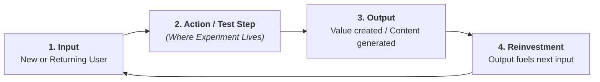

# Growth Experimentation, Hypothesis Gating, & Loop Acceleration Framework

A high-velocity experimentation engine does not merely run isolated A/B tests; it accelerates **compounding growth loops** and converts every test result (win or loss) into permanent organizational intelligence.

---

## 1. Product Work Classification & Experiment Routing

Not every product change requires a 14-day A/B test. Match the validation method to the type of product bet:

| Work Type | Core Objective | Primary Validation Mechanism | When to A/B Test |
| :--- | :--- | :--- | :--- |
| **1. Funnel Optimization** | Remove friction from existing high-traffic paths. | Quantitative A/B Testing ($p < 0.05$). | Always, when traffic exceeds statistical power requirements. |
| **2. Growth Loop Accelerators** | Increase the compounding velocity of self-reinforcing loops. | A/B Testing with cohort retention tracking. | High priority; test the specific loop reinvestment step. |
| **3. Step-Function / PMF Bets** | Introduce net-new capabilities or expand into new segments. | Qualitative Discovery $\to$ Alpha/Beta Cohort Retention. | Do **not** use A/B tests on early PMF bets (traffic is too low and conversion is a false proxy). |

---

## 2. Growth Loop Step Mapping

Every growth experiment must state which stage of the self-reinforcing loop it accelerates:



* **The Loop Test Rule**: An experiment is only high-leverage if increasing the step's efficiency increases the volume or speed of the downstream reinvestment step.

---

## 3. The Pre-Experiment Qualitative Gate

> *"Never use expensive engineering hours and A/B test traffic to discover what 5 user interviews could have told you for free."*

Before allocating traffic to a live A/B test:
1. **Friction Evidence**: Provide at least 5 session recordings, customer support tickets, or VoC problem tags demonstrating the specific breakdown.
2. **Behavioral Usability Check**: Verify that users in usability testing understand the proposed variant without hand-holding.

---

## 4. The Canonical Hypothesis Formula

$$\text{If we } [\text{Action/Intervention}] \longrightarrow \text{Then } [\text{Behavioral Shift}] \longrightarrow \text{Resulting in } [\Delta \text{ Primary Metric}] \longrightarrow \text{Because } [\text{Core Rationale}]$$

### Example:
*"If we introduce an inline viral invite prompt immediately after a user creates their first shared workspace, then active creators will invite their teammates during peak dopamine, resulting in a 15% lift in Day-7 Team Activation, because user intent to collaborate is highest right after workspace creation."*

---

## 5. Metric Hierarchy & Guardrail Invariants

```
┌─────────────────────────────────────────────────────────────────────────────┐
│                             METRIC SCORECARD                                │
├──────────────────────────────┬──────────────────────────────┬───────────────┤
│ Primary Metric (Decision)    │ Secondary Metrics (Signals)  │ Guardrails    │
├──────────────────────────────┼──────────────────────────────┼───────────────┤
│ • Single decision metric.    │ • Leading adoption signals.  │ • Must NOT    │
│ • Directly tied to loop step.│ • Mid-funnel progression.    │   degrade.    │
│ • E.g., Team Activation %.   │ • E.g., Invites Sent / User. │ • Latency     │
│                              │                              │ • Support Vol │
│                              │                              │ • Retention   │
└──────────────────────────────┴──────────────────────────────┴───────────────┘
```

---

## 6. Statistical Sizing & Runtime Rules

### Minimum Detectable Effect (MDE) & Sample Size:
For standard two-tailed tests ($\alpha = 0.05$, Power = $80\%$):
$$n \approx \frac{16 \cdot \sigma^2}{\text{MDE}^2}$$

### Practical Operating Rules:
1. **14-Day Minimum Duration**: Always run for at least 14 full days (two business cycles) to eliminate day-of-week seasonality bias.
2. **No Peeking**: Never stop a test early simply because $p < 0.05$ on Day 3. Pre-commit to sample size and duration.

---

## 7. The 3-Way Experiment Post-Mortem Taxonomy

When a test fails to achieve statistical significance or fails guardrails, classify the learning:

```
┌─────────────────────────────────────────────────────────────────────────────┐
│                    EXPERIMENT POST-MORTEM TAXONOMY                          │
├──────────────────────────────┬──────────────────────────────┬───────────────┤
│ 1. Invalidated Mental Model  │ 2. Execution Mismatch        │ 3. Under-Power│
├──────────────────────────────┼──────────────────────────────┼───────────────┤
│ • The underlying behavioral  │ • The hypothesis was right,  │ • The effect  │
│   hypothesis was wrong.      │   but the UI/UX was confusing│   size was    │
│ • Log in central knowledge   │   or hidden.                 │   smaller than│
│   base; do NOT re-test.      │ • Redesign variant and re-run│   sample MDE. │
└──────────────────────────────┴──────────────────────────────┴───────────────┘
```
