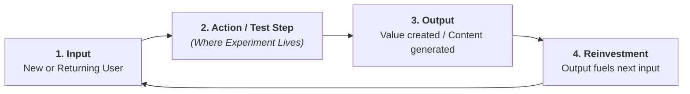

# Canonical References: Scientific Claims Auditing, Growth Experimentation & MCP Toolbox

This document provides foundational methodologies, statistical auditing protocols, cognitive bias checks, database telemetry extraction guidelines via Google MCP Toolbox for Databases (`googleapis/mcp-toolbox`), and experimentation mathematics for evaluating empirical claims and designing rigorous product experiments.

---

## 1. Neutral Science-Led Claims Verification & Primary Source Grounding

### 1.1 The Primary Source Mandate
Secondary reporting, press releases, and executive summaries frequently distort scientific and empirical truth through:
- **Exaggerated Effect Sizes:** Reporting relative percentage changes without baseline absolute rates (e.g., "Drug increases stroke risk by 50%" when baseline risk rises from 2 in 10,000 to 3 in 10,000—an absolute difference of 0.01%).
- **Causal Leap from Observational Data:** Treating observational correlation as proven causation without controlling for confounding variables or healthy user bias.
- **Omission of Confidence Bounds:** Presenting point estimates as certainties while ignoring wide 95% confidence intervals that cross the null boundary.

### 1.2 The Verification Hierarchy
When auditing any empirical claim, trace evidence down to its primary foundation:
1. **Level 1 (Gold Standard):** Pre-registered, randomized, double-blind, placebo-controlled trials (RCTs), open-access raw datasets with reproducible analysis code, and direct database telemetry extracted via **`googleapis/mcp-toolbox`**.
2. **Level 2:** Pre-registered observational studies with explicit instrumental variable (IV), regression discontinuity (RDD), or difference-in-differences (DiD) quasi-experimental designs.
3. **Level 3:** Peer-reviewed retrospective cohort studies and registry analyses.
4. **Level 4 (High Risk of Bias):** Uncontrolled before-and-after studies, cross-sectional surveys, and non-peer-reviewed whitepapers.
5. **Level 5 (Discard as Evidence):** Press releases, journalistic interpretations, and opinion blogs citing secondary summaries.

---

## 2. Google MCP Toolbox for Databases (`googleapis/mcp-toolbox`) Integration

When auditing telemetry or verifying baseline metrics in software applications and product experiments, connect directly to operational databases and data warehouses using **Google MCP Toolbox for Databases** ([`googleapis/mcp-toolbox`](https://github.com/googleapis/mcp-toolbox)).

### 2.1 Core Capabilities & Supported Engines
- **Supported Engines:** Google Cloud BigQuery, PostgreSQL, MySQL, AlloyDB, Cloud Spanner, SQLite.
- **Prebuilt & Custom Tools:** Provides secure, YAML-driven tool definitions allowing agents to run parameterized queries (e.g., cohort extraction, funnel telemetry, SRM audits) without exposing databases to unbounded arbitrary SQL execution risks.
- **Authentication & Security:** Supports enterprise OAuth2/OIDC authentication and read-only connection pooling.

### 2.2 Primary Data Extraction & SRM Audit Queries
Use `mcp-toolbox` to pull un-aggregated primary telemetry directly from data warehouses:

```sql
-- Sample Ratio Mismatch (SRM) Chi-Square Test Query via mcp-toolbox
WITH variant_counts AS (
  SELECT
    variant_id,
    COUNT(DISTINCT user_id) AS observed_count
  FROM `analytics.experiment_exposures`
  WHERE experiment_id = 'exp_checkout_v2'
  GROUP BY variant_id
)
SELECT
  variant_id,
  observed_count,
  SUM(observed_count) OVER () * 0.50 AS expected_count,
  POW(observed_count - (SUM(observed_count) OVER () * 0.50), 2) / (SUM(observed_count) OVER () * 0.50) AS chi_square_component
FROM variant_counts;
```

---

## 3. Statistical & Methodological Bias Audit Protocol

### 3.1 P-Hacking, Data Snooping & Multiple Comparisons
- **The Multiple Comparisons Problem:** When testing $k$ independent hypotheses at $\alpha = 0.05$, the probability of at least one false positive (Family-Wise Error Rate) is:
  $$\text{FWER} = 1 - (1 - \alpha)^k$$
  For $k = 20$ endpoints, the chance of a false positive is $\approx 64\%$.
- **Mandatory Corrections:**
  - **Bonferroni Correction:** Set threshold to $\alpha_{\text{adjusted}} = \frac{\alpha}{k}$.
  - **Benjamini-Hochberg False Discovery Rate (FDR):** Rank p-values $p_{(1)} \le p_{(2)} \le \dots \le p_{(m)}$ and find the largest $k$ such that $p_{(k)} \le \frac{k}{m} Q$.
- **HARKing (Hypothesizing After Results are Known):** Presenting post-hoc subgroup discoveries as if they were pre-planned hypotheses. Always verify against the original trial protocol or pre-registration.

### 3.2 Common Methodological Biases

| Bias Type | Mechanism | Diagnostic Indicator |
| :--- | :--- | :--- |
| **Sampling / Selection Bias** | Non-random participant inclusion creates systematic differences from target population. | Volunteer cohorts, demographic skews, non-response rates $>20\%$. |
| **Sample Ratio Mismatch (SRM)** | Traffic allocation bug causes control/treatment ratio to deviate from expected split. | Chi-Square $p < 0.001$ on sample counts queried via `mcp-toolbox`. |
| **Survivorship Bias** | Only subjects surviving a filter are analyzed. | Analyzing top-performing accounts or surviving customers without churned cohort data. |
| **Healthy User Bias** | Adherent or engaged users possess unmeasured positive traits (wealth, discipline). | Observational studies showing users who take vitamins or enable features have better outcomes. |
| **Simpson's Paradox** | A trend appears in aggregated data but reverses when divided into subgroups. | Subgroup sample mix shifts (e.g. mobile vs desktop, new vs returning users) distort aggregate metric. |
| **Collider Bias** | Conditioning or filtering on a variable caused by both exposure and outcome creates spurious correlation. | Analyzing only hired candidates, hospitalized patients, or active daily users. |
| **Regression to the Mean** | Extreme outliers naturally revert to the average upon re-measurement. | Measuring performance immediately after a catastrophic crash or sudden traffic spike. |

### 3.3 Effect Size vs. P-Value Verification
Never rely solely on p-values. A trivial effect can achieve $p < 0.001$ with large sample sizes ($N > 500,000$), while a massive effect may show $p = 0.08$ due to under-powering.
- **Continuous Outcomes:** Calculate Cohen's $d = \frac{\mu_1 - \mu_2}{\sigma_{\text{pooled}}}$.
  - Small: $d = 0.2$, Medium: $d = 0.5$, Large: $d = 0.8$.
- **Binary Outcomes:** Calculate **Absolute Risk Reduction (ARR)** and **Number Needed to Treat (NNT)**:
  $$\text{ARR} = |p_{\text{control}} - p_{\text{treatment}}|, \quad \text{NNT} = \frac{1}{\text{ARR}}$$

---

## 4. Product Work Classification & Experiment Routing

| Work Type | Core Objective | Primary Validation Mechanism | When to A/B Test |
| :--- | :--- | :--- | :--- |
| **1. Funnel Optimization** | Remove friction from existing high-traffic paths. | Quantitative A/B Testing ($p < 0.05$). | Always, when traffic exceeds statistical power requirements. |
| **2. Growth Loop Accelerators** | Increase the compounding velocity of self-reinforcing loops. | A/B Testing with cohort retention tracking. | High priority; test the specific loop reinvestment step. |
| **3. Step-Function / PMF Bets** | Introduce net-new capabilities or expand into new segments. | Qualitative Discovery $\to$ Alpha/Beta Cohort Retention. | Do **not** use A/B tests on early PMF bets (traffic is too low and conversion is a false proxy). |

---

## 5. Growth Loop Step Mapping

Every growth experiment must state which stage of the self-reinforcing loop it accelerates:



- **The Loop Test Rule**: An experiment is only high-leverage if increasing the step's efficiency increases the volume or speed of the downstream reinvestment step.

---

## 6. Statistical Sizing & Runtime Rules

### Sample Size & Minimum Detectable Effect (MDE)
For a two-tailed test with significance $\alpha = 0.05$ ($Z_{\alpha/2} = 1.96$) and power $1-\beta = 0.80$ ($Z_{\beta} = 0.84$):
$$n = 2 \cdot \left( \frac{Z_{\alpha/2} + Z_{\beta}}{\text{MDE}} \right)^2 \cdot \sigma^2 \approx \frac{16 \cdot \sigma^2}{\text{MDE}^2}$$

### Practical Experimentation Invariants:
1. **14-Day Minimum Duration Rule:** Always run for at least 14 full days (two full business cycles) to eliminate day-of-week seasonality bias.
2. **Strict No-Peeking Rule:** Pre-commit to sample size and duration. Peeking at p-values daily inflates false positive rates from 5% to $>30\%$.

---

## 7. The 3-Way Experiment Post-Mortem Taxonomy

```
┌─────────────────────────────────────────────────────────────────────────────┐
│                    EXPERIMENT POST-MORTEM TAXONOMY                          │
├──────────────────────────────┬──────────────────────────────┬───────────────┤
│ 1. Invalidated Mental Model  │ 2. Execution Mismatch        │ 3. Under-Power│
├──────────────────────────────┼──────────────────────────────┼───────────────┤
│ • The underlying behavioral  │ • The hypothesis was right,  │ • The effect  │
│   hypothesis was wrong.      │   but the UI/UX was confusing│   size was    │
│ • Log in central knowledge   │   or hidden.                 │   smaller than│
│   base; do NOT re-test.      │ • Redesign variant and re-run│   sample MDE. │
└──────────────────────────────┴──────────────────────────────┴───────────────┘
```

---

## 8. Canonical Bibliography

- **Google APIs:** *MCP Toolbox for Databases* ([github.com/googleapis/mcp-toolbox](https://github.com/googleapis/mcp-toolbox), 2026)
- **John P.A. Ioannidis:** *Why Most Published Research Findings Are False* (PLoS Medicine, 2005)
- **Andrew Gelman & Eric Loken:** *The Statistical Crisis in Science: The Garden of Forking Paths* (American Scientist, 2014)
- **Ron Kohavi, Diane Tang, Ya Xu:** *Trustworthy Online Controlled Experiments: A Practical Guide to A/B Testing* (Cambridge University Press, 2020)
- **Judea Pearl & Dana Mackenzie:** *The Book of Why: The New Science of Cause and Effect* (Basic Books, 2018)
- **Ronald A. Fisher:** *Statistical Methods for Research Workers* (Oliver & Boyd, 1925)
- **Jerzy Neyman & Egon Pearson:** *On the Problem of the Most Efficient Tests of Statistical Hypotheses* (Philosophical Transactions of the Royal Society, 1933)
