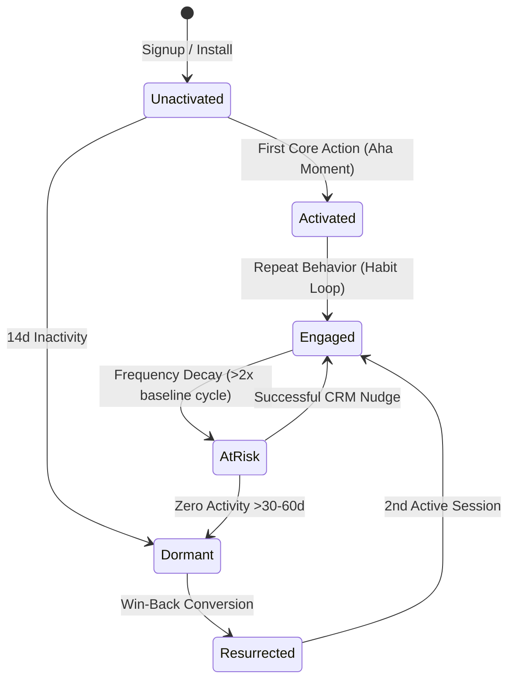
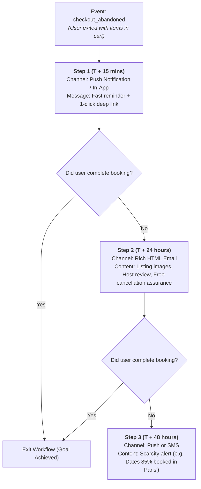

# Lifecycle Marketing, CRM Automation, & Retention Workflows

In high-scale consumer and marketplace companies (Airbnb, Uber, DoorDash, Pinterest, Instacart), customer acquisition is only the first step. Over **60-80% of enterprise value** is generated through automated, event-driven lifecycle CRM that activates users, recovers abandoned intent, and prevents churn.

---

## 1. The 6-Stage Customer Lifecycle State Machine



---

## 2. Multi-Channel Playbook Architectures

### Playbook A: Abandoned Booking / Cart Recovery Waterfall



---

## 3. Standard Channel Matrix & Operational Constraints

| Channel | Best For | Max Frequency | Latency Window | Optimal Copy Constraints |
| :--- | :--- | :--- | :--- | :--- |
| **In-App Message (Modal/Banner)** | Contextual onboarding, immediate feature discovery. | Real-time on screen view. | 0 seconds | Title: $\le 35$ chars, Body: $\le 90$ chars, Single prominent CTA. |
| **Push Notification** | Urgent intent recovery, travel alerts, price drops. | Max 1 / day | 15 mins – 2 hours | Title: $\le 40$ chars, Body: $\le 90$ chars, Direct deep link URI. |
| **Email (Lifecycle)** | Rich visual summary, social proof, multi-item carousels. | Max 2 / week | 12 hours – 48 hours | Subject: $\le 50$ chars, Preheader: $\le 80$ chars, 1 primary button. |
| **SMS / WhatsApp** | High-intent transaction confirmations, urgent cart lock. | Max 1 / 7 days (Requires explicit opt-in) | 1 hour – 24 hours | $\le 160$ chars including opt-out (`STOP to cancel`). |

---

## 4. Global Fatigue Capping & Safety Invariants

```
┌─────────────────────────────────────────────────────────────────────────────┐
│                       GLOBAL CRM FREQUENCY POLICIES                         │
├─────────────────────────────────────────────────────────────────────────────┤
│ 1. UNIVERSAL SEND CAPS:                                                     │
│    • Push Notifications: Maximum 1 marketing push per 24 hours per user.     │
│    • Marketing Emails: Maximum 2 emails per 7 rolling days.                 │
│    • SMS: Maximum 1 message per 7 rolling days.                             │
│ 2. QUIET HOURS ENFORCEMENT:                                                 │
│    • Zero marketing push notifications or SMS between 21:00 and 09:00       │
│      in the user's localized timezone.                                      │
│ 3. DELIVERABILITY & REPUTATION INVARIANTS:                                  │
│    • Spam complaint rate must stay strictly < 0.08% (Google/Yahoo standard).│
│    • Hard bounce rate must stay strictly < 1.5%.                            │
│    • 1-Click List-Unsubscribe header mandatory in all outgoing emails.      │
│ 4. HOLDOUT EXPERIMENTATION:                                                 │
│    • Always reserve a 5% universal control holdout to measure true         │
│      incremental lift vs organic conversion.                                │
└─────────────────────────────────────────────────────────────────────────────┘
```

---

## 5. High-Impact Automated Workflows

### 1. New User Activation (FTUX Drip)
- **Day 0**: Welcome email + guide to first search filter.
- **Day 2 (If no search)**: Push notification highlighting curated local weekend stays.
- **Day 5 (If search but no wishlist save)**: In-app prompt showing 1-click wishlist saving.
- **Day 7 (If wishlist saved but no booking)**: Email featuring price-drop alerts on saved listings.

### 2. Predictive Churn / Win-Back Sequence
- **Trigger**: $p_{	ext{churn}} > 0.70$ or user exceeds $2.5	imes$ mean inter-booking interval (e.g. 180 days since last trip).
- **Step 1 (Day 0)**: Personalized *"We miss you"* email featuring top destinations from user's travel history.
- **Step 2 (Day 7)**: Push alert featuring exclusive seasonal traveler credits or perks.
- **Step 3 (Day 14)**: 1-question feedback survey (*"How can we make your next trip easier?"*).
