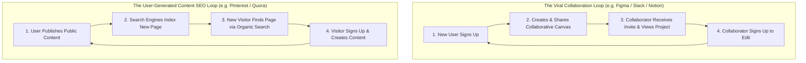
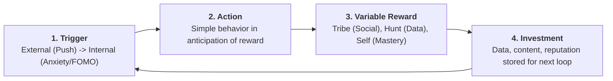

# Growth Product Management, Growth Loops, & Retention

Growth product management focuses on **sustainable, compounding acquisition and retention**. While traditional marketing treats growth as a linear funnel (Acquire $\to$ Activate $\to$ Retain), modern growth architecture operates through **self-reinforcing loops**.

---

## 1. The Expert Methodology Roster

```
┌─────────────────────────────────────────────────────────────────────────────┐
│                       GROWTH EXPERT METHODOLOGY ROSTER                      │
├──────────────────────────────────────┬──────────────────────────────────────┤
│ 1. BRIAN BALFOUR: Growth Loops & Fits│ 2. FAREED MOSAVAT: Retention-First   │
│ The 4 Growth Fits & closed-loop      │ Natural frequency of use &           │
│ flywheels (Loops > Funnels).         │ quantitative activation milestones.  │
├──────────────────────────────────────┼──────────────────────────────────────┤
│ 3. ELENA VERNA: Product-Led Growth   │ 4. NIR EYAL: The Hooked Model        │
│ Self-serve freemium/trial loops,     │ Trigger -> Action -> Variable Reward │
│ product-led sales (PLS) triggers.    │ -> Investment (stored value).        │
├──────────────────────────────────────┼──────────────────────────────────────┤
│ 5. JOSH ELMAN: The Core Action       │ 6. LENNY RACHITSKY: 7 Growth Channels│
│ The single value-creating metric:    │ The Racecar Growth Model (Engine,    │
│ "Users performing the core action."  │ Turbochargers, Lubricants, Fuel).    │
└──────────────────────────────────────┴──────────────────────────────────────┘
```

---

## 2. Brian Balfour: Growth Loops vs Linear Funnels

Linear funnels require constantly pouring more paid marketing dollars into the top. Growth loops reinvest user activity to acquire the next cohort:



### The 4 Growth Fits Framework:
1. **Market-Product Fit**: Product solves a burning problem for a large, growing market.
2. **Product-Channel Fit**: Products are built for specific channels (e.g. SEO, Virality, Paid), not vice-versa.
3. **Channel-Model Fit**: Channel cost matches monetization model (e.g. Low ARPU requires virality/SEO; High ARPU supports outbound sales).
4. **Model-Market Fit**: Number of customers $	imes$ ARPU equals a $\$100M+$ business.

---

## 3. Fareed Mosavat & Josh Elman: Natural Frequency & Activation

Growth starts with retention, and retention is governed by the product's **Natural Frequency**:

| Natural Frequency | Example Products | Core Action | Healthy Activation Milestone |
| :--- | :--- | :--- | :--- |
| **Daily** | Slack, Instagram, Twitter | Send message / View feed | Send 10 messages in Day 1 |
| **Weekly** | Notion, Asana, Linear, Jira | Update task / Edit document | Complete 3 tasks in first 7 days |
| **Monthly** | Gusto, QuickBooks, Carta | Run payroll / Reconcile ledger | Execute 1st payroll within 14 days |
| **Seasonal / Annual** | Airbnb, TurboTax, Booking.com | Search & Book trip / File taxes | Save 1 wishlist & search within 3 days |

---

## 4. Nir Eyal: The Hooked Model


