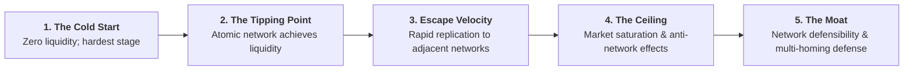

# Two-Sided Marketplace Product Management

Two-sided marketplaces (Airbnb, Uber, DoorDash, Etsy, Instacart) are distinct from traditional SaaS because **value is created through network liquidity between two distinct participant types (Demand and Supply)**.

---

## 1. The Expert Methodology Roster

```
┌─────────────────────────────────────────────────────────────────────────────┐
│                   MARKETPLACE EXPERT METHODOLOGY ROSTER                     │
├──────────────────────────────────────┬──────────────────────────────────────┤
│ 1. ANDREW CHEN: The Cold Start       │ 2. CASEY WINTERS: Marketplace Loops  │
│ Atomic networks, the Hard Side, the  │ Supply-constrained vs Demand-        │
│ Tipping Point, and Escape Velocity.  │ constrained growth loops.            │
├──────────────────────────────────────┼──────────────────────────────────────┤
│ 3. DAN HOCKENMAIER: Liquidity Engine │ 4. BILL GURLEY: 10 Marketplace Rules │
│ Fill rates, search-to-book ratio,    │ High take-rate, high frequency,      │
│ and asymmetric participant dynamics. │ fragmented supply, expanding TAM.    │
├──────────────────────────────────────┼──────────────────────────────────────┤
│ 5. GOKUL RAJARAM: SPADE Framework    │ 6. AIRBNB / UBER: Operating Mechanics│
│ Decision clarity, opportunity sizing,│ Search ranking, dynamic surge        │
│ and take-rate fee elasticity.        │ pricing, and quality tiering.        │
└──────────────────────────────────────┴──────────────────────────────────────┘
```

---

## 2. Andrew Chen: The Cold Start Problem & Atomic Networks



### The Atomic Network Rule:
An **Atomic Network** is the smallest viable network that can sustain itself organically (e.g. Uber in San Francisco, Airbnb in NYC during conferences, Tinder at USC).
- Never launch broad before winning a tight density cell.
- In each atomic cell, **solve the Hard Side first** (typically Supply).

---

## 3. Bill Gurley: 10 Characteristics of a Great Marketplace

1. **High Frequency of Use**: Frequent transactions build habit.
2. **High Fragmentation**: Many small buyers and many small sellers prevent disintermediation.
3. **High Take-Rate Potential**: Sustainable 10-25% rake without user revolt.
4. **Significant Value-Add Services**: Insurance, trust, payment facilitation, reviews, instant booking.
5. **Expanding the Addressable Market**: Lowering friction unlocks latent demand/supply.
6. **Two-Sided Network Effects**: Each new host attracts more guests; each new guest attracts more hosts.
7. **Economic Advantage Over Legacy**: Dramatically cheaper or faster than traditional brokers.
8. **Scalable Acquisition Loops**: Organic word-of-mouth and SEO vs reliance on paid ads.
9. **Monetizable Transactions**: Native in-app payment flow (never off-platform cash).
10. **Transparency & Trust**: Solves asymmetric information through public ratings and verification.

---

## 4. Dan Hockenmaier: Marketplace Liquidity Metrics

```
┌─────────────────────────────────────────────────────────────────────────────┐
│                       MARKETPLACE LIQUIDITY SCORECARD                       │
├──────────────────────────────────────┬──────────────────────────────────────┤
│ 1. FILL RATE (Search-to-Match)       │ 2. SEARCH-TO-BOOK RATIO              │
│ Target: >85-95% of demand requests   │ Number of searches required per      │
│ successfully matched with supply.    │ booking. (Lower indicates high fit). │
├──────────────────────────────────────┼──────────────────────────────────────┤
│ 3. SUPPLIER UTILIZATION RATE         │ 4. TIME-TO-CONFIRM (LATENCY)         │
│ % of listing days booked per month.  │ Instant Book: 0 seconds              │
│ (Too low = churn; Too high = stockout│ Request to Book: <2 hours            │
└──────────────────────────────────────┴──────────────────────────────────────┘
```
