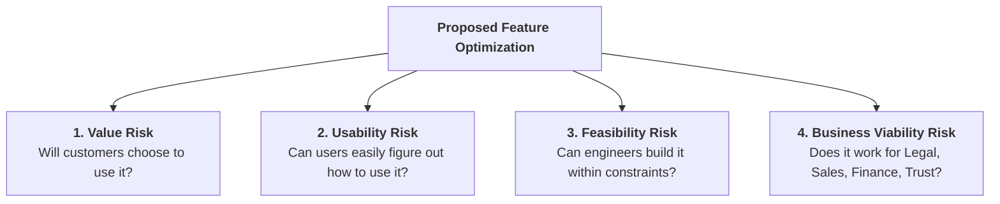
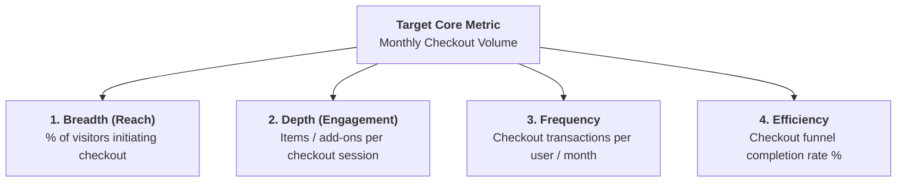

# Feature & Optimizer Product Management

Feature and Optimizer PMs focus on **maximizing the value, efficiency, and adoption of existing core product workflows**. Their primary enemy is the **"Feature Factory" trap**—measuring output (features shipped) rather than customer outcomes.

---

## 1. The Expert Methodology Roster

```
┌─────────────────────────────────────────────────────────────────────────────┐
│                    OPTIMIZER EXPERT METHODOLOGY ROSTER                      │
├──────────────────────────────────────┬──────────────────────────────────────┤
│ 1. MARTY CAGAN: Empowered Teams      │ 2. JOHN CUTLER: Metric Trees & Flow  │
│ 4 Product Risks (Value, Usability,   │ 4-dimension metric decomposition &   │
│ Feasibility, Viability).             │ escaping the Feature Factory trap.   │
├──────────────────────────────────────┼──────────────────────────────────────┤
│ 3. SHREYAS DOSHI: High-Agency PM     │ 4. STEVE KRUG: "Don't Make Me Think" │
│ Pre-mortems, LNO framework, and      │ Thoughtless usability & visual       │
│ high-leverage product judgment.      │ hierarchy clarity.                   │
├──────────────────────────────────────┼──────────────────────────────────────┤
│ 5. DON NORMAN: Interaction Design    │ 6. BAYMARD INSTITUTE: E-Commerce UX  │
│ Affordances, signifiers, conceptual  │ Empirical checkout benchmark data    │
│ models, and forgiving error recovery.│ and form field minimization rules.   │
├──────────────────────────────────────┼──────────────────────────────────────┤
│ 7. JEFF PATTON: User Story Mapping   │ 8. EDO VAN ROYEN: Compact PRDs       │
│ Narrative backbone & vertical release│ Decision-ready requirements with     │
│ slicing by end-to-end user value.    │ zero fluff or ambiguity.             │
└──────────────────────────────────────┴──────────────────────────────────────┘
```

---

## 2. Marty Cagan: The 4 Product Risks

Before writing detailed feature tickets, the team must address four critical risks:



---

## 3. John Cutler: 4-Dimension Metric Tree Decomposition

Deconstruct high-level goals into responsive behavioral inputs across 4 dimensions:



---

## 4. Shreyas Doshi: The Pre-Mortem & High-Agency Judgment

> *"A pre-mortem is an exercise in prospective hindsight. Rather than asking why a project failed after the fact, assume it failed catastrophically and identify the causes before writing code."*

### Pre-Mortem Execution Matrix:
1. **The Premise**: Assume it is 6 months post-launch. Adoption is $<5\%$, negative reviews are flooding support, and the executive team is asking what went wrong.
2. **Brainstorm Failure Modes**:
   - *Cognitive Overload*: We added 3 extra form fields that confused mobile users.
   - *Edge Case Breakdown*: Foreign currency transactions failed silently on Safari iOS.
   - *Wrong Incentive*: Users felt penalized by the cancellation fee disclosure.
3. **Mitigation Guardrails**: Turn every failure mode into a non-negotiable PRD invariant.
