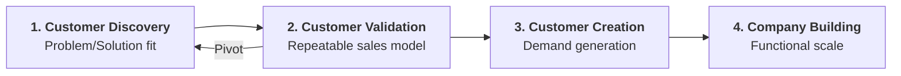
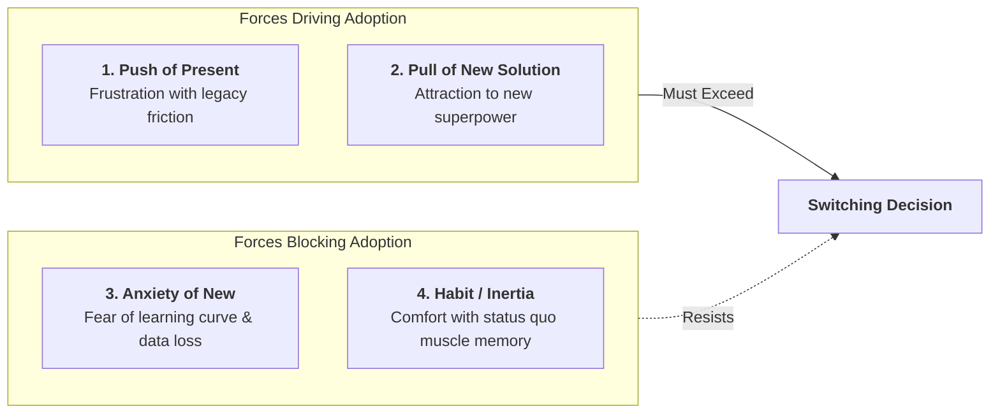
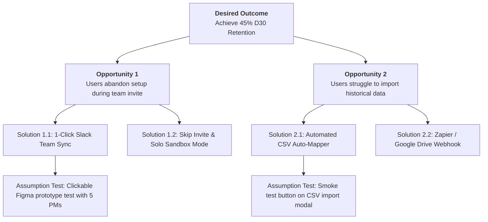

# 0-to-1 Product Management, Customer Discovery, & PMF

In 0-to-1 product management, the primary mission is **navigating extreme market uncertainty to discover, validate, and build a repeatable business model that achieves Product-Market Fit (PMF)**.

---

## 1. The Expert Methodology Roster

```
┌─────────────────────────────────────────────────────────────────────────────┐
│                       0-TO-1 EXPERT METHODOLOGY ROSTER                      │
├──────────────────────────────────────┬──────────────────────────────────────┤
│ 1. STEVE BLANK: Customer Development │ 2. ERIC RIES: The Lean Startup       │
│ "Get out of the building." Search vs │ Build-Measure-Learn feedback loops,  │
│ Execution; Earlyvangelist profile.   │ Concierge & Wizard of Oz MVPs, LOFA. │
├──────────────────────────────────────┼──────────────────────────────────────┤
│ 3. TERESA TORRES: Continuous Disc.   │ 4. RAHUL VOHRA: Quantitative PMF     │
│ Opportunity Solution Trees (OST) &   │ 40% "Very Disappointed" metric and   │
│ weekly customer interview cadences.  │ High-Expectation Customer (HXC).     │
├──────────────────────────────────────┼──────────────────────────────────────┤
│ 5. CLAYTON CHRISTENSEN: JTBD         │ 6. ASH MAURYA: Lean Canvas           │
│ Four Forces of Progress (Push, Pull, │ Riskiest Assumption Testing (RAT) &  │
│ Anxiety, Habit) & Non-consumption.   │ Problem/Solution vs PMF vs Scale.    │
├──────────────────────────────────────┼──────────────────────────────────────┤
│ 7. JAKE KNAPP: 5-Day Design Sprint   │ 8. DAN OLSEN: PMF Pyramid            │
│ Fast-forward prototyping with 5-user │ Problem Space vs Solution Space and  │
│ testing (85% flaw discovery).        │ Opportunity Scoring formula.         │
└──────────────────────────────────────┴──────────────────────────────────────┘
```

---

## 2. Steve Blank: Customer Development & The Search Mode

Startups are not smaller versions of large companies:
- **Large Companies** execute known business models.
- **Startups** search for a repeatable, scalable business model.

### The Four Steps to the Epiphany:


### The Earlyvangelist Checklist:
1. Has a severe, recurring problem.
2. Is conscious of having the problem.
3. Has actively assembled a makeshift workaround.
4. Has or can acquire budget to buy a real solution.

---

## 3. Clayton Christensen: Jobs-to-be-Done & Four Forces

Customers "hire" products to make progress in a specific circumstance. The decision to switch requires overcoming inertia:



$$	ext{Switching Rule}: (F_{	ext{Push}} + F_{	ext{Pull}}) > (F_{	ext{Habit}} + F_{	ext{Anxiety}})$$

---

## 4. Teresa Torres: Opportunity Solution Trees (OST)

Never jump from a strategic business outcome directly into writing code for a feature:



---

## 5. Rahul Vohra: The Quantitative PMF Engine (Superhuman Method)

Rahul Vohra systematized Product-Market Fit into an optimizable algorithm based on Sean Ellis's 40% benchmark:

### The 40% Leading Indicator:
> *"How would you feel if you could no longer use [Product]?"*
> - **A) Very disappointed**
> - **B) Somewhat disappointed**
> - **C) Not disappointed (it really isn't that useful)**

$$	ext{PMF Score} = rac{N_{	ext{Very Disappointed}}}{N_{	ext{Total Valid Respondents}}} 	imes 100 \ge 40\%$$

### The 50/50 Roadmap Prioritization Rule:
1. **Isolate High-Expectation Customers (HXC)**: Filter respondents who answered *Very Disappointed*.
2. **Double Down (50% Bandwidth)**: Allocate 50% of roadmap to deepening what HXC users love.
3. **Overcome Blockers (50% Bandwidth)**: Allocate 50% of roadmap to fixing friction points for *Somewhat Disappointed* users whose main desired benefit matches the HXC. (Completely ignore *Not Disappointed* users).
