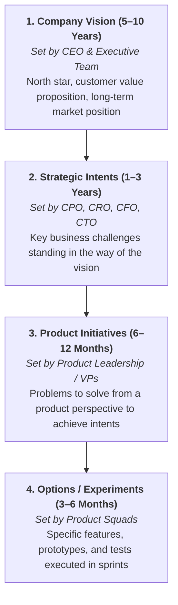

# Decision Stack & Strategic Governance Framework

## 1. The Melissa Perri Decision Stack

---

## 2. Decision Stack Mapping Example (Pipeline 3K)

| Level | Intended Focus | Owner | Concrete Example |
| :--- | :--- | :--- | :--- |
| **Vision** | North star for portfolio and customer differentiation. | Executive Team | *"Pipeline 3K is a suite of easy-to-use services enabling recruiters and job seekers to seamlessly find and fill roles."* |
| **Strategic Intent** | Business outcome overcoming key challenge. | CPO & C-Suite | *"Shore up the mid-market segment and return it to growth, increasing revenue by 30%."* |
| **Product Initiative** | Problem to address across products. | Product VPs/Directors | *"Increase adoption of network capability within mid-market segment by 60%."* |
| **Option** | Specific quarterly experiment/bet. | Squad (PM + Eng + Design) | *"Redesign the onboarding funnel to immediately demonstrate network value."* |

---

## 3. Strategic Meeting Cadences & Expectations

| Cadence | Forum | Invitees | In Scope | Out of Scope |
| :--- | :--- | :--- | :--- | :--- |
| **Annual** | Company Kick-Off (CKO) | All Company | Vision, annual strategic intents, portfolio roadmap | Feature-level specs |
| **Quarterly** | QBR | Execs & Leads | OKR/KPI progress, funding allocation, major pivots | UX design details |
| **Quarterly** | Cross-Functional Roadmap | Eng, Sales, Mktg, CS | Initiative interdependencies, release timing, risks | Bug triage |
| **Monthly** | Roadmap Review | Product Leads | Strategic intent progress, option performance | Resourcing debates |
| **Monthly** | Demo Days | Sales, Mktg, CS | Feature walk-throughs, Alpha/Beta/GA phases | Strategy changes |
