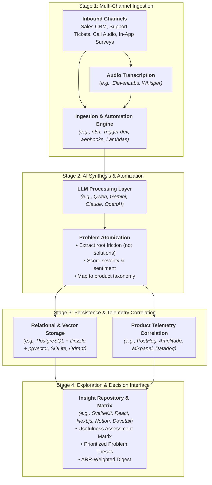

# Voice of Customer (VoC) Pipeline & ResearchOps Architecture

## 1. Abstract Pipeline Architecture

The Voice of Customer pipeline transforms unstructured qualitative feedback across the organization into structured, prioritized product intelligence. Specific tools and vendors are examples of how each functional stage can be implemented:



---

## 2. The 4 Functional Pipeline Stages

| Stage | Operational Purpose | Key Responsibilities | Illustrative Tech Examples |
| :--- | :--- | :--- | :--- |
| **1. Ingestion & Automation** | Centralize incoming feedback from distributed teams without manual data entry. | • Listen to webhook events<br/>• Transcribe recorded calls<br/>• Poll customer support queues | • n8n, Trigger.dev, Zapier, custom HTTP webhooks<br/>• ElevenLabs, OpenAI Whisper, Deepgram |
| **2. AI Synthesis & Extraction** | Convert raw complaints and transcripts into structured problem entities. | • Separate user friction from requested solutions<br/>• Tag sentiment and severity<br/>• Semantic vector deduplication | • LiteLLM gateway, Qwen, Gemini Flash, Claude, GPT-4o<br/>• Langfuse, Promptfoo for eval monitoring |
| **3. Persistence & Telemetry** | Store relational records and connect qualitative claims to quantitative user behavior. | • Link feedback to customer ARR/segment<br/>• Correlate feedback tags with funnel drop-offs and error spikes | • PostgreSQL (Supabase/Neon) with Drizzle/Prisma<br/>• pgvector, Qdrant, Pinecone<br/>• PostHog, Amplitude, Mixpanel |
| **4. Interface & Governance** | Make customer problems easily discoverable and actionable for product teams. | • Multi-dimensional search & filtering<br/>• Fidelity-style Usefulness Assessment<br/>• Input into PRDs and roadmap reviews | • SvelteKit + Tailwind / React + Next.js<br/>• TanStack Table / Zero sync<br/>• Dovetail, Notion, Productboard |

---

## 3. Reference Persistence Schema (Abstract Entity Model)

Regardless of the database or ORM used, the underlying data model should capture:

```typescript
// Abstract VoC Data Model Concept
interface FeedbackSignal {
  id: string;
  sourceChannel: 'sales' | 'support' | 'uxr' | 'in_app' | string;
  customerSegment: 'smb' | 'mid_market' | 'enterprise' | string;
  arrValue?: number;
  rawContent: string;
  transcriptionRef?: string;
  telemetrySessionRef?: string; // Links to product analytics session
  createdAt: Date;
}

interface ProblemThesis {
  id: string;
  title: string;
  description: string;
  severity: 'blocker' | 'high' | 'medium' | 'low';
  usefulnessStatus: 'fully_met' | 'partially_met' | 'not_met';
  vectorEmbedding?: number[]; // For clustering & deduplication
  linkedSignals: string[];
  createdAt: Date;
}
```

---

## 4. The Usefulness Assessment Matrix (Fidelity Model)

Evaluate core user jobs across product offerings to guide roadmap prioritization:

| Ranked User Need | Product A | Product B | Product C | Synthesis & Status |
| :--- | :---: | :---: | :---: | :--- |
| *1. Real-time audit data export* | Fully Met (✓) | Not Met (✗) | Partially Met (~) | High satisfaction in core; gaps in bundle exports. |
| *2. Multi-currency invoicing* | Not Met (✗) | Not Met (✗) | Not Met (✗) | **Top driver of enterprise lost deals & churn.** |
| *3. Dynamic strategy adjustments* | Partially Met (~) | Fully Met (✓) | Not Met (✗) | Usability friction on mobile; smooth on desktop. |

* **Rating Scale**:
  - **Fully Met (✓)**: Fast, intuitive, zero workarounds required.
  - **Partially Met (~)**: Functional but high friction, confusing UX, or manual export required.
  - **Not Met (✗)**: No capability exists; customers resort to third-party tools or churn.
