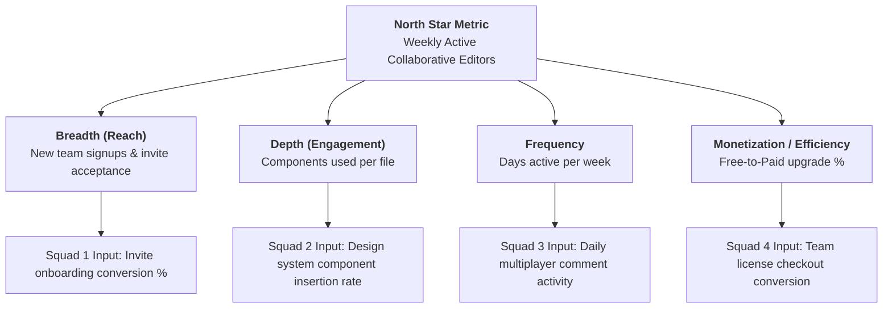

# Metric Tree Decomposition & Incentive Architecture Framework

## 1. The North Star Metric (NSM) Principle

A true North Star Metric captures **value exchanged**—not pure revenue (lagging) and not vanity activity (superficial).

```
┌─────────────────────────────────────────────────────────────────────────────┐
│                       THE NORTH STAR METRIC DUALITY                         │
├──────────────────────────────────────┬──────────────────────────────────────┤
│ CUSTOMER VALUE DELIVERED             │ BUSINESS VALUE CAPTURED              │
├──────────────────────────────────────┼──────────────────────────────────────┤
│ Users successfully solving their     │ Predictable revenue, retention, and  │
│ core problem.                        │ customer lifetime value.             │
└──────────────────────────────────────┴──────────────────────────────────────┘
```

### Examples:
* **Spotify**: *Time Spent Listening to Quality Music* (not raw logins).
* **Airbnb**: *Nights Booked* (not searches performed).
* **Figma**: *Weekly Active Collaborative Editors* (not total file views).

---

## 2. Metric Tree Decomposition Formula



---

## 3. Goodhart's Law & Guardrail Pairing

> *"When a measure becomes a target, it ceases to be a good measure."* — Goodhart's Law

To prevent teams from gaming metrics or destroying long-term value for short-term gains, every input metric must have a structural guardrail:

| Squad Target (Input Metric) | Gaming Risk (Output Theater) | Paired Guardrail Metric (Invariant) |
| :--- | :--- | :--- |
| **New User Signup Conversion** | Spamming low-quality leads; deceptive UX patterns. | **Day-30 Retention & Spam Registration Rate** |
| **Push Notification Click Rate** | Clickbait spam notifications driving users crazy. | **App Notification Opt-Out & Unsubscribe Rate** |
| **Sales Demo Booking Volume** | Booking unqualified leads to hit quota. | **Demo Show-Up Rate & Sales Pipeline Qualified %** |
| **Feature Release Velocity** | Shipping buggy code to hit deadline. | **P0/P1 Bug Defect Rate & Rollback Frequency** |
