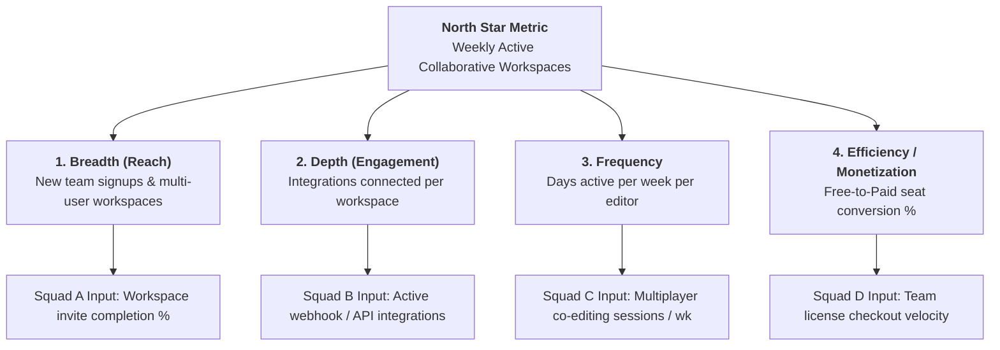

# North Star Metric Trees, Anti-Goodhart Governance, & Incentive Architecture

A resilient metric tree translates a single high-level business vision into **responsive, actionable customer behavioral inputs** while protecting the system from Goodhart's Law gaming and output theater.

---

## 1. The North Star Metric (NSM) Principle

A true North Star Metric represents the **Value Exchange Duality**—where customer success generates sustainable business value:

```
┌─────────────────────────────────────────────────────────────────────────────┐
│                       THE VALUE EXCHANGE DUALITY                            │
├──────────────────────────────────────┬──────────────────────────────────────┤
│ CUSTOMER VALUE DELIVERED             │ BUSINESS VALUE CAPTURED              │
├──────────────────────────────────────┼──────────────────────────────────────┤
│ E.g., Fast, reliable audio           │ E.g., High subscription retention,   │
│ streaming with zero buffer delays.   │ reduced churn, and high LTV.         │
└──────────────────────────────────────┴──────────────────────────────────────┘
```

---

## 2. The 4-Dimension Metric Tree Decomposition (John Cutler Model)

High-level metrics (ARR, LTV, Total Users) are lagging outputs that cannot guide day-to-day squad discovery. Decompose the NSM across 4 core dimensions:



---

## 3. The 3R Input Metric Validation Test

Before assigning an input metric to a squad, verify that it passes all three 3R criteria:

| Criterion | Standard | Failure Anti-Pattern |
| :--- | :--- | :--- |
| **Responsive** | Metric shifts measurably within **1–4 weeks** of a feature launch or experiment. | Tracking ARR or annual retention (lagging by 6–12 months). |
| **Representational** | Measures an observable **customer action**, not internal team output. | Tracking "story points shipped" or "PRDs completed" (Output Theater). |
| **Reflexive** | Moves up when user experience improves; moves down when broken. | Vanity page views that increase when users are lost and searching for help. |

---

## 4. The Metric Pre-Mortem & Anti-Gaming Protocol

> *"When a measure becomes a target, it ceases to be a good measure."* — Goodhart's Law

### The Pre-Mortem Attack Simulation:
Before locking any squad target, conduct an adversarial simulation:
*"If a team wanted to 5x this input metric by next month without improving the product, how would they game it?"*

### Mandatory Guardrail Pairing:
Every input metric must be paired with an invariant guardrail derived from the pre-mortem:

| Squad Input Metric | Pre-Mortem Gaming Vector | Paired Guardrail Metric (Invariant) |
| :--- | :--- | :--- |
| **New Workspace Creation %** | Auto-generating empty dummy workspaces during signup. | **Day-14 Multi-User Active Rate & Zero-Action Workspace %** |
| **Push Notification CTR** | Sending clickbait alarmist push alerts. | **Push Opt-Out Rate & App Uninstalls within 24h** |
| **Sales Demo Bookings** | Booking unqualified or incentivized leads. | **Sales-Accepted Opportunity % & Show-Up Rate** |
| **Feature Release Velocity** | Shipping buggy code to hit arbitrary sprint deadlines. | **P0/P1 Bug Defect Rate & 48h Rollback Frequency** |

---

## 5. The 4-Quadrant Weekly Operating Rhythm (Christina Wodtke Model)

Metric trees must live in a weekly operational cadence rather than being shelved between quarterly QBRs:

```
┌──────────────────────────────────────┬──────────────────────────────────────┐
│ QUADRANT 1: Priority Active Bets     │ QUADRANT 2: 3R Input Metric Trend    │
│ • Experiment 1: 1-click team invite  │ • Metric: Invite Completion %        │
│ • Experiment 2: Slack auth sync      │ • Week 1: 22% ➔ Week 2: 29% (+7% Δ)  │
├──────────────────────────────────────┼──────────────────────────────────────┤
│ QUADRANT 3: Confidence Score (1–10)  │ QUADRANT 4: Health Invariants        │
│ • Current Score: 8 / 10              │ • Bug Defect Rate: <0.05% (Green)    │
│ • Rationale: Strong invite adoption; │ • Spam Invite Complaints: 0 (Green)  │
│   desktop performance remains fast.  │ • Team Burnout / Morale: Good (Green)│
└──────────────────────────────────────┴──────────────────────────────────────┘
```

---

## 6. The Proxy Invalidation Rule

If an input metric increases for **2 consecutive quarters** while the parent North Star Metric remains flat or declines, the correlation was spurious. **Deprecate the input metric immediately** and re-anchor on new behavioral customer research.
