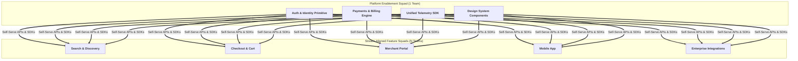

# Internal Platform Enablement & Leverage Architecture Framework

## 1. The Platform Multiplier Law

> *"A successful platform team does not build features for users; it builds capabilities that allow 10 stream-aligned teams to ship features 5x faster with zero friction."*

---

## 2. Thinnest Viable Platform (TVP) Principles

To avoid building bloated internal monoliths that no one wants to use:
1. **Self-Serve First**: If integrating with the platform requires a Jira ticket or meeting with a platform engineer, the platform has failed.
2. **Opt-In with Compelling DX**: Make the platform so fast and clean that teams adopt it voluntarily rather than through heavy-handed executive mandates.
3. **Guardrails over Gates**: Provide pre-configured templates, typed SDKs, and automated linters instead of manual approval committees.

---

## 3. Platform Leverage Metrics

| Metric | Target Benchmark | How to Measure |
| :--- | :--- | :--- |
| **Time-to-First-Integration (TTFI)** | $< 30 	ext{ minutes}$ | Time from a stream engineer reading docs to making first successful API call. |
| **Duplicate Code Elimination** | $> 70\% 	ext{ reduction}$ | Reduction in boilerplate auth/telemetry code across microservices. |
| **Platform Adoption Rate** | $> 85\% 	ext{ of squads}$ | % of stream squads actively consuming versioned platform primitives. |
| **Leverage ROI Ratio** | $> 4 : 1$ | (Engineering days saved by squads) / (Platform maintenance days). |
