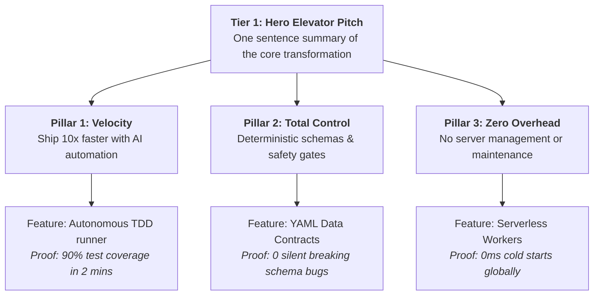

# Product Marketing Positioning, Messaging Hierarchy, & Narrative

At companies like Airbnb, Apple, and Stripe, Product Marketing Managers (PMMs) bridge product engineering and market perception. A great feature with poor narrative positioning will fail to achieve adoption.

---

## 1. The 6-Part Positioning Statement (Geoffrey Moore Model)

```
┌─────────────────────────────────────────────────────────────────────────────┐
│                       THE POSITIONING FRAMEWORK                             │
├─────────────────────────────────────────────────────────────────────────────┤
│ • FOR: [Target ICP / Buyer Persona]                                         │
│ • WHO: [Urgent Customer Pain / Unmet Job-to-be-Done]                        │
│ • THE: [Product Name] IS A [Category / Frame of Reference]                  │
│ • THAT: [Primary Transformational Outcome / Superpower]                     │
│ • UNLIKE: [Status Quo / Primary Alternative]                                │
│ • OUR PRODUCT: [Undeniable Differentiator & Secret Sauce]                   │
└─────────────────────────────────────────────────────────────────────────────┘
```

---

## 2. The 3-Tier Messaging Hierarchy

A messaging hierarchy ensures that everyone from the CEO to Sales reps tells a unified, consistent story:



---

## 3. The Value Proposition Canvas Alignment

| Customer Profile (The User Truth) | Product Value Map (Our Solution) |
| :--- | :--- |
| **Customer Jobs**: Orchestrate multi-agent coding workflows across product, design, and data. | **Products & Services**: Software Maestro agent skill symphony. |
| **Customer Pains**: Fragmented context, hallucinated stats, uncoordinated subagents, breaking schema drifts. | **Pain Relievers**: Enforced data contracts, binary evals, causal inference guardrails, deterministic pod handoffs. |
| **Customer Gains**: High-velocity autonomous product delivery with enterprise-grade quality. | **Gain Creators**: Turnkey cross-functional pod orchestration from PRD to production deploy. |

---

## 4. Competitive Battlecard Matrix

```
┌─────────────────────────────────────────────────────────────────────────────┐
│ COMPETITIVE BATTLECARD                                                      │
├──────────────────────────────────────┬──────────────────────────────────────┤
│ 1. LANDMINES TO LAY                  │ 2. COMPETITOR OBJECTION REFRAME      │
│ Ask competitors: 'How do your agents │ Objection: 'Isn't multi-agent too    │
│ prevent silent schema breaks in prod?'│ complex?' Reframe: 'Uncoordinated    │
│ (Exposes their lack of data contracts)│ agents fail; our pod enforces gates.' │
├──────────────────────────────────────┼──────────────────────────────────────┤
│ 3. WHY WE WIN (Differentiators)      │ 4. WHEN TO WALK AWAY                 │
│ • End-to-end horizontal pod parity   │ • User only wants a trivial one-file │
│ • Strict binary eval testing gates   │   single-line bash script.           │
└──────────────────────────────────────┴──────────────────────────────────────┘
```
