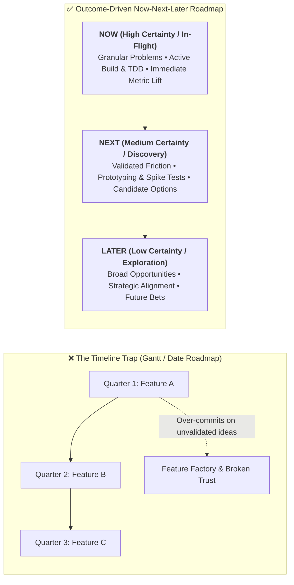
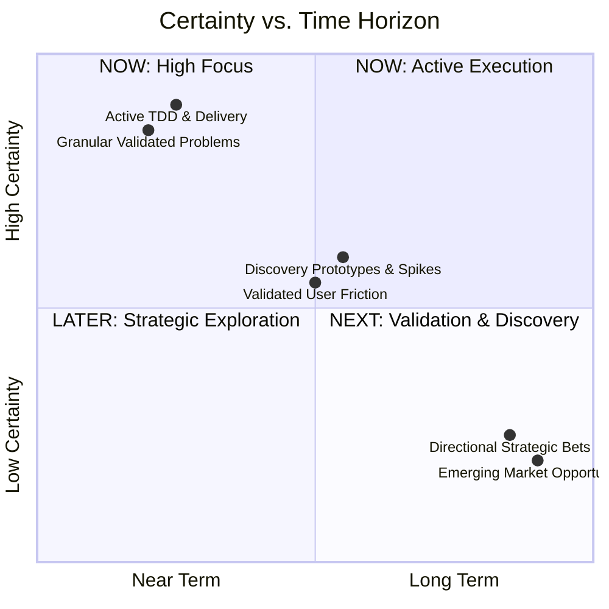
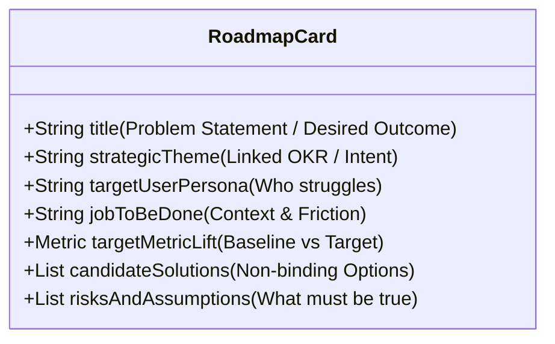
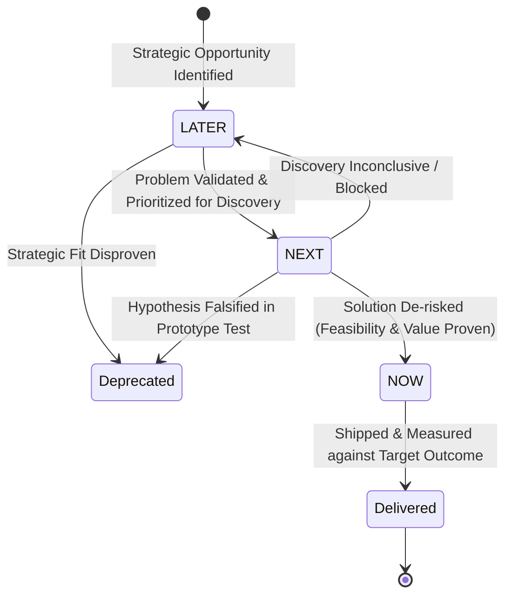

# Now-Next-Later Roadmapping Framework (Janna Bastow)

## 1. The Core Philosophy: Escaping the Timeline Trap

Traditional timeline roadmaps (Gantt charts with delivery dates mapped months in advance) fail because they conflate two completely distinct operational needs:
1. **Strategic Product Roadmap**: Communicates *why* we are investing in specific problems and *what outcomes* we expect to achieve.
2. **Release / Delivery Plan**: Coordinates *how* and *when* validated solutions will be packaged, deployed, and supported cross-functionally.



---

## 2. The Three Horizons of Uncertainty



### Horizon Taxonomy & Governance Matrix

| Dimension | NOW (Current Horizon) | NEXT (Near-Term Horizon) | LATER (Future Horizon) |
| :--- | :--- | :--- | :--- |
| **Typical Horizon** | Current cycle (0–2 months) | Near-term pipeline (1–4 months) | Long-term roadmap (3–12+ months) |
| **Certainty Level** | **High ($\approx 80-90\%$)** | **Medium ($\approx 50-70\%$)** | **Low ($\approx 20-40\%$)** |
| **Problem Granularity** | Crisp, tightly scoped customer struggle | Validated friction; open solution space | Broad market opportunity or strategic theme |
| **Stage of Work** | Active engineering, TDD, UX implementation | Discovery interviews, facade prototypes, spikes | Strategic observation, user research, data analysis |
| **Commitment Type** | Committed to solving the problem now | Committed to investigating and testing | Uncommitted; subject to reprioritization or killing |
| **WIP Limit** | Strict: 2–4 initiatives per pod | Moderate: 3–6 problem spaces in discovery | Flexible: 5–10 strategic opportunities |
| **Deliverables** | Working software, passing tests, metric lift | Validated learnings, clickable prototypes, PRDs | Market sizing, strategic problem briefs |

---

## 3. Anatomy of an Outcome-Oriented Roadmap Card

Every item on a Now-Next-Later roadmap represents a **problem to solve**, not a pre-specified feature.



### Roadmap Card Template

```markdown
### [Problem-Oriented Title] (e.g., "Eliminate Multi-Account Switching Friction")

- **Strategic Theme / OKR**: Expand Enterprise Expansion Revenue (KR: Boost Multi-Org User Retention by 25%)
- **Target Persona**: Enterprise Organization Admin managing multiple subsidiaries
- **Problem Statement (JTBD)**: When switching between client workspaces, admins must log out and log back in with different credentials, causing 4.2 minutes of wasted time per switch and 18% weekly churn among power admins.
- **Target Outcome**: Reduce workspace transition time to <2 seconds; decrease multi-org admin drop-off by 50%.
- **Candidate Solutions (Options)**:
  - *Option A*: Global unified session token with cross-org dropdown switcher.
  - *Option B*: Delegated admin access portal with SAML SSO bridging.
  - *Option C*: Native desktop workspace multi-tab architecture.
- **Current Certainty & Horizon**: `NOW` (Option A selected and in active TDD build).
- **Exit / Success Criteria**: Workspace switch completes in <2s with 0 re-authentications across 95% of active sessions.
```

---

## 4. Full Concrete Example: B2B SaaS Workflow Platform Roadmap

### Strategic Theme 1: Enterprise Workflow Automation
*Objective: Accelerate mid-market workflow throughput and reduce manual execution bottlenecks.*

| Horizon | Problem to Solve (Card Title) | Target Metric Lift | Candidate Solutions / Status |
| :--- | :--- | :--- | :--- |
| **NOW** | **Webhook Trigger Latency & Dropped Payloads** | Reduce p99 ingestion latency from 1,200ms to <150ms; 0 dropped events. | - Redis queue buffer with exponential backoff retry worker (In Build).<br/>- Dead-letter queue alert webhook (In QA). |
| **NEXT** | **Multi-Step Conditional Logic Configuration Fatigue** | Increase workflow completion rate from 34% to 65% for non-technical admins. | - Visual node-based branching canvas.<br/>- Natural language rule parser (Spike test in progress). |
| **LATER** | **Cross-Platform Enterprise Audit & Compliance Governance** | Enable SOC2 Type II automated logging for Fortune 500 prospects. | - Immutable audit log stream with SIEM export.<br/>- Role-based granular field-level masking. |

### Strategic Theme 2: Developer Ecosystem & Extensibility
*Objective: Drive self-serve developer adoption and platform stickiness.*

| Horizon | Problem to Solve (Card Title) | Target Metric Lift | Candidate Solutions / Status |
| :--- | :--- | :--- | :--- |
| **NOW** | **Custom Connector Authoring Friction** | Reduce time-to-first-working-connector from 6 hours to <30 minutes. | - CLI scaffolding generator (`agy-cli` / `wrangler`).<br/>- TypeScript SDK with built-in mock testing harness. |
| **NEXT** | **Community Connector Discovery & Monetization** | Increase monthly active community connector installs by 300%. | - Verified developer marketplace directory.<br/>- Usage-based revenue share billing via Stripe. |
| **LATER** | **Distributed Edge Execution for Custom Connectors** | Sub-10ms localized execution for global webhook actions. | - Cloudflare Workers isolate sandboxing.<br/>- Regional state replication. |

---

## 5. Horizon Progression & Governance Rules



### Promotion & Graduation Criteria

1. **From LATER to NEXT**:
   - Problem aligns with an active Strategic Intent / OKR for the upcoming quarter.
   - Initial qualitative or quantitative evidence indicates significant customer pain or demand.
   - Dedicated discovery capacity assigned to explore candidate options.
2. **From NEXT to NOW**:
   - Customer problem validated through user interviews or data analysis.
   - At least 1 candidate solution de-risked via technical spike or prototype facade.
   - Measurable target outcome and acceptance criteria defined.
   - Engineering pod has capacity within WIP limits (2–4 active items).
3. **From NOW to Delivered**:
   - Feature shipped to production.
   - Telemetry confirms target outcome or learning is codified (`ralph-loop`).

---

## 6. Anti-Pattern Diagnostic & Repair Matrix

| Anti-Pattern | Root Cause | Symptom / Failure Mode | Corrective Action |
| :--- | :--- | :--- | :--- |
| **Hidden Gantt Chart** | Dates disguised under Now/Next/Later columns (e.g. "Now = Q1, Next = Q2, Later = Q3"). | Dates slip; teams rush unverified code; stakeholders treat Later as contractual delivery. | Remove all quarter/date labels from roadmap columns. Use release plans strictly for near-term committed shipping dates. |
| **Feature Dumping** | Cards written as specific UI features ("Build blue export button") instead of problems. | Team builds the specified feature even when discovery reveals users need an automated API sync instead. | Reframe card titles as: *[Verb] [User Struggle / Outcome]* (e.g. *"Eliminate Manual CSV Export Bottleneck"*). |
| **Frozen Later Column** | Treating Later as a dumping ground or immutable backlog. | Later grows to 150 dead ideas; roadmap loses credibility. | Audit Later horizon monthly. Prune items older than 6 months that lack strategic alignment. |
| **Missing Target Metrics** | Cards lack measurable outcomes. | Success is declared upon code deployment rather than customer value delivery ("The Build Trap"). | Mandate baseline vs. target metric on 100% of Now and Next cards before work begins. |
| **Overloaded Now Horizon** | Team places 12 concurrent initiatives in Now. | Extreme context switching, half-finished features, and delivery gridlock. | Enforce strict WIP limits: maximum 2–4 cards in Now per engineering pod. |
