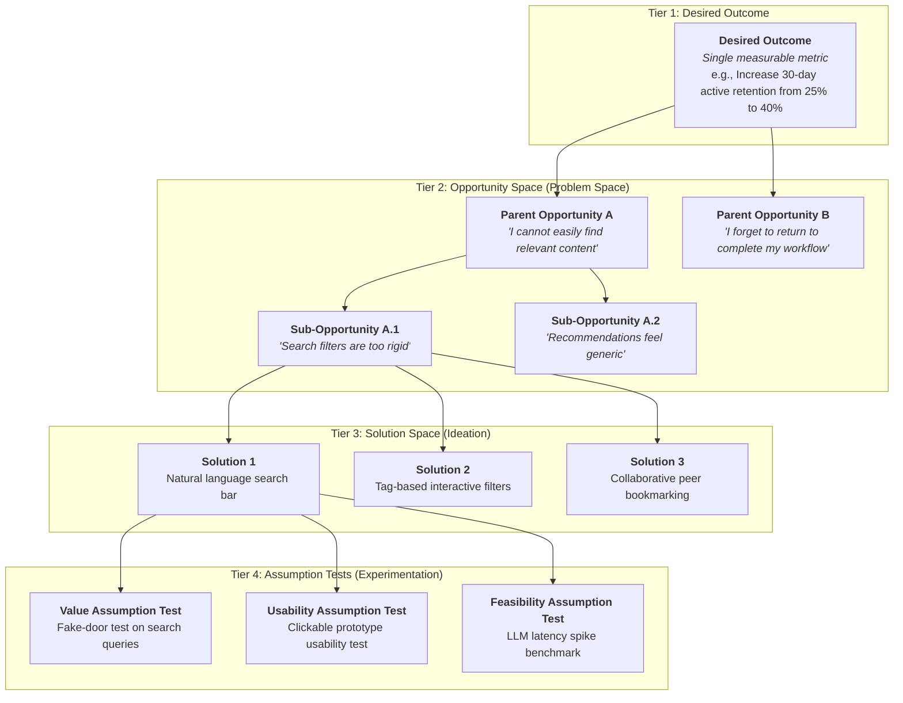
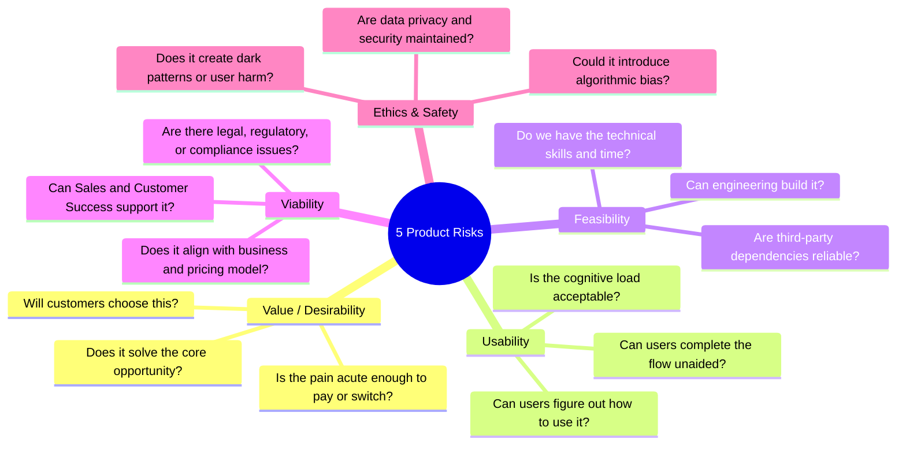
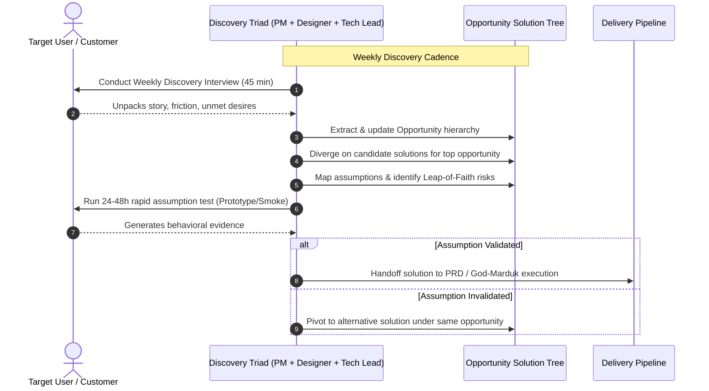

# Opportunity Solution Tree (OST) & Continuous Discovery Framework

## 1. The 4-Tier Opportunity Solution Tree Architecture

The Opportunity Solution Tree (OST), developed by **Teresa Torres** (*Continuous Discovery Habits*) and championed by **Marty Cagan** (*Inspired*, *Empowered*), provides a visual roadmap for continuous product discovery. It ensures product teams connect high-level business and product outcomes to real customer pain points before exploring multiple potential solutions and running targeted assumption tests.



---

## 2. Framing Opportunities vs. Feature Ideas

An opportunity is a customer need, pain point, friction point, or desire. It resides strictly in the **problem space**, whereas features belong in the **solution space**.

| Dimension | Poorly Framed (Feature Trap) | Properly Framed Opportunity (Customer Voice) |
| :--- | :--- | :--- |
| **Search & Discovery** | *"Build an AI semantic search engine."* | *"I cannot find items when I don't know the exact technical keyword."* |
| **Onboarding** | *"Create a 5-step tutorial tooltip walkthrough."* | *"I don't understand the core value proposition within my first 2 minutes."* |
| **Collaboration** | *"Add Google Docs-style real-time comments."* | *"I lose context when discussing changes outside our primary workspace."* |
| **Notifications** | *"Send daily push notification digests."* | *"I miss critical project deadlines because reminders get buried in email."* |
| **Billing & Plans** | *"Integrate Stripe tiered subscription checkout."* | *"I cannot predict our monthly spend as our team size fluctuates."* |

---

## 3. The 5 Product Risk Dimensions (Marty Cagan & Teresa Torres)

When evaluating solutions, teams must deconstruct each idea into its foundational assumptions across five core risk dimensions:



### Risk Dimension Breakdown

1. **Value Risk (Desirability)**:
   - *Question*: Will customers buy it or choose to use it?
   - *Key Assumption*: Users perceive enough value to alter existing habits or pay money.
   - *Testing Method*: Smoke tests, landing page conversion tests, LOI (Letter of Intent) requests, user interviews.

2. **Usability Risk**:
   - *Question*: Can users figure out how to use it effectively?
   - *Key Assumption*: Users intuitively understand UI affordances, terminology, and workflows.
   - *Testing Method*: Unmoderated usability sessions, clickable prototypes, task completion time studies.

3. **Feasibility Risk**:
   - *Question*: Can our engineers build and scale this with available time and technology?
   - *Key Assumption*: Backend algorithms, third-party APIs, and databases can meet performance, scale, and latency requirements.
   - *Testing Method*: Technical spikes, proof-of-concept benchmarks, load testing on mock endpoints.

4. **Viability Risk**:
   - *Question*: Does this solution work for the business as a whole?
   - *Key Assumption*: Solution complies with legal (GDPR/HIPAA), finance (unit economics), sales, marketing, and brand guidelines.
   - *Testing Method*: Cross-functional stakeholder reviews, margin calculations, legal compliance audits.

5. **Ethics & Safety Risk**:
   - *Question*: Does this solution create unintended negative consequences or exploit users?
   - *Key Assumption*: Data handling is fair, transparent, and non-exploitative.
   - *Testing Method*: Ethical pre-mortems, bias testing on datasets, privacy threat modeling.

---

## 4. Assumption Mapping & Rapid Testing Matrix

Instead of building full Minimum Viable Products (MVPs) to test a whole solution, teams map individual assumptions on a 2x2 grid to isolate high-risk unknowns.

```
       HIGH IMPORTANCE (Failure is fatal to the solution)
                           │
             LEAP OF FAITH │ PLAN & PROCEED
           ┌───────────────┼───────────────┐
           │   TEST NOW    │  BUILD WITH   │
           │ (Experiment)  │  CONFIDENCE   │
           │               │               │
LOW EVIDENCE ──────────────┼─────────────── HIGH EVIDENCE
(Unknown / Guess)          │               (Validated / Known)
           │  EVALUATE     │   IGNORE /    │
           │   LATER       │    PRUNE      │
           └───────────────┼───────────────┘
                           │
       LOW IMPORTANCE (Minor inconvenience if wrong)
```

### Rapid Experiment Types

| Experiment Type | Cost / Speed | Best For Testing | Concrete Example |
| :--- | :--- | :--- | :--- |
| **Fake-Door / Smoke Test** | Low ($<1$ day) | Value & Demand | Adding a "Generate AI Summary" button that triggers a "Coming Soon / Join Waitlist" modal to measure intent clicks. |
| **Concierge Prototype** | Low ($1–2$ days) | Value & Feasibility | Manually matching candidates via spreadsheet behind a mockup interface to test workflow viability before writing code. |
| **Clickable Prototype Test** | Medium ($2–3$ days) | Usability & Desirability | Testing an interactive Figma prototype with 5 target users to observe task completion friction. |
| **Technical Spike** | Medium ($2–4$ days) | Feasibility & Scale | Writing a standalone script querying vector database endpoints to benchmark latency under 10k QPS. |
| **Wizard of Oz** | Medium ($3–5$ days) | Value & Interaction Flow | Presenting an automated UI while a human manually fulfills backend tasks behind the scenes. |

---

## 5. Continuous Discovery Triad Operational Cadence

The **Product Triad** (Product Manager, Product Designer, Tech Lead) discovers together in continuous weekly loops.



---

## 6. Anti-Patterns & Systematic Repairs

| Anti-Pattern | Manifestation | Root Cause | Systematic Repair |
| :--- | :--- | :--- | :--- |
| **Solution First / Orphan Solutions** | Feature list masquerading as a discovery roadmap without linked customer problems. | Team starts with exciting ideas rather than customer pain points. | Force every solution to attach as a child node under a validated Opportunity node in the OST. |
| **Whether-or-Not Trap** | Team debates whether to build Solution A vs. doing nothing at all. | Fixating on the first idea generated (confirmation bias). | Enforce generating at least 3 distinct competing solutions per sub-opportunity before testing. |
| **Testing Whole MVPs** | Spending 6 weeks building software just to test if users want a feature. | Conflating delivery with discovery. | Isolate the top Leap-of-Faith assumption and run a 1-day smoke test or prototype test instead. |
| **Outcome Shifting** | Changing metrics mid-stream when a solution fails to perform. | Lack of strategic commitment to the target outcome. | Lock the root Desired Outcome node; change solutions and opportunities, not the goal. |
| **The Scribe PM** | PM interviews customers alone and passes notes down to design and engineering. | Siloed functional hierarchy. | Involve Product Designer and Tech Lead in every discovery interview and assumption mapping session. |
