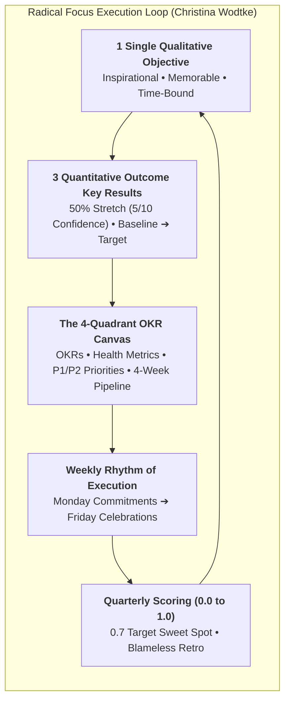
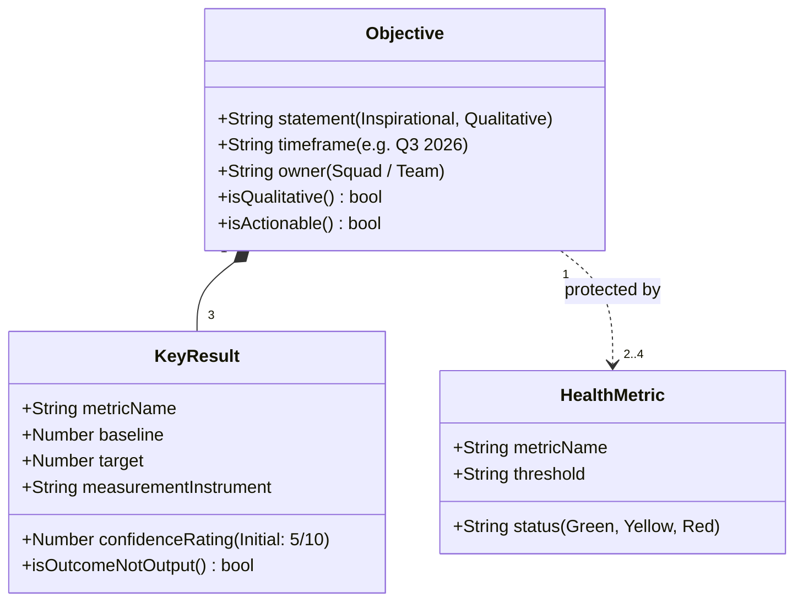

# Outcome OKRs & Radical Focus Execution Framework (Christina Wodtke)

## 1. The Core Philosophy: Radical Focus

Most OKR implementations fail because they turn into bloated task checklists with 5–10 diffuse objectives that are filed away and forgotten until the end of the quarter. Christina Wodtke's **Radical Focus** methodology establishes:
1. **One Single Objective**: The team unites behind one memorable, qualitative goal that galvanizes action.
2. **Three Outcome Key Results**: Measured as changes in customer behavior or business value, not feature delivery.
3. **50% Stretch Target (5/10 Confidence)**: The sweet spot where ambition drives creative problem solving without inducing panic.
4. **The 4-Quadrant Execution Canvas**: A living operational artifact reviewed weekly to connect daily work to strategic goals while protecting operational health.



---

## 2. The 4-Quadrant Radical Focus Canvas Architecture

The 4-Quadrant Canvas combines strategic goals, health metrics, near-term priorities, and future pipeline visibility on a single page.

```
┌──────────────────────────────────────────┬──────────────────────────────────────────┐
│ QUADRANT 1: OBJECTIVE & KEY RESULTS      │ QUADRANT 3: THIS WEEK'S PRIORITIES       │
│                                          │                                          │
│ Objective: [Qualitative Inspirational]   │ P1 (Must-Do - Max 3):                     │
│ • KR1: [Metric A: Base ➔ Target] (5/10)  │ 1. [High-leverage action moving KR1]     │
│ • KR2: [Metric B: Base ➔ Target] (5/10)  │ 2. [High-leverage action moving KR2]     │
│ • KR3: [Metric C: Base ➔ Target] (5/10)  │ 3. [High-leverage action moving KR3]     │
│                                          │                                          │
│                                          │ P2 (Should-Do - Max 2):                   │
│                                          │ 4. [Secondary initiative]                │
│                                          │ 5. [Secondary initiative]                │
├──────────────────────────────────────────┼──────────────────────────────────────────┤
│ QUADRANT 2: HEALTH METRICS (GUARDRAILS)  │ QUADRANT 4: NEXT 4 WEEKS PIPELINE        │
│                                          │                                          │
│ • [Metric 1: e.g., System Uptime >99.9%] │ • Week 2: [Upcoming spike or prototype]  │
│   Status: 🟢 Green                       │ • Week 3: [Cross-functional dependency]  │
│ • [Metric 2: e.g., Team Burnout / Morale]│ • Week 4: [GTM enablement or beta test]  │
│   Status: 🟢 Green                       │                                          │
│ • [Metric 3: e.g., Customer CSAT > 4.2]  │                                          │
│   Status: 🟡 Yellow                      │                                          │
└──────────────────────────────────────────┴──────────────────────────────────────────┘
```

---

## 3. Formulating High-Impact OKRs



### Outcome vs. Output Key Result Conversion

| Feature / Output Trap (❌ WRONG) | Measurable Outcome Key Result (✅ CORRECT) | Rationale |
| :--- | :--- | :--- |
| "Launch new onboarding flow by Nov 15." | "Increase Day-7 user activation from 14% to 32%." | Shipping the flow is useless if users still bounce. Outcome measures customer adoption. |
| "Build 5 new API endpoints for integrations." | "Grow weekly API transaction volume from 50k to 500k calls." | Measures utility and usage of APIs rather than lines of code created. |
| "Redesign the pricing page." | "Improve pricing page trial conversion from 2.1% to 4.8%." | Focuses team on conversion efficacy rather than visual aesthetics alone. |
| "Conduct 20 customer discovery interviews." | "Validate 3 scalable use cases with >60% willingness-to-pay intent." | Measures knowledge and market signal gained, not hours spent in meetings. |

---

## 4. Full Concrete Example: FinTech Growth Pod 4-Quadrant Canvas

### Objective: Transform our instant payout service into the #1 retention hook for high-volume gig economy contractors.

| Quadrant 1: Objective & Key Results | Quadrant 3: This Week's Priorities |
| :--- | :--- |
| **Objective**: *Transform instant payout into our #1 gig contractor retention hook.*<br/><br/>**Key Results**:<br/>• **KR1**: Increase Instant Payout adoption rate among active contractors from **18% to 50%** (Confidence: `6/10` 🟢).<br/>• **KR2**: Reduce mean payout completion latency from **45 seconds to <3 seconds** (Confidence: `5/10` 🟡).<br/>• **KR3**: Boost 90-day contractor retention for instant payout users from **42% to 68%** (Confidence: `5/10` 🟡). | **P1 (Must-Do — Direct Impact on KRs)**:<br/>1. Deploy Redis token cache for payment route pre-authorization to drop latency (moves KR2).<br/>2. Launch 1-click debit card linking flow in mobile app (moves KR1).<br/>3. A/B test push notification prompt upon earnings threshold trigger (moves KR1).<br/><br/>**P2 (Should-Do)**:<br/>4. Refactor Stripe webhook failure alert telemetry.<br/>5. Conduct 5 usability tests on fee disclosure UI. |
| **Quadrant 2: Health Metrics (Guardrails)** | **Quadrant 4: Next 4 Weeks Pipeline** |
| • **Payment Processing Error Rate**: < 0.05% (`0.02%` 🟢 Green).<br/>• **Customer Support Ticket Volume**: < 2.0 tickets per 1,000 transactions (`1.4` 🟢 Green).<br/>• **Team Sustainable Pace & Morale**: ≥ 8/10 (`8.5/10` 🟢 Green).<br/>• **Transaction Fraud Rate**: < 0.01% (`0.008%` 🟢 Green). | • **Week 2**: Technical spike on FedNow real-time clearing rail feasibility.<br/>• **Week 3**: Cross-functional alignment with Risk and Legal for higher instant limits.<br/>• **Week 4**: Merchant pilot launch with top 3 gig platforms.<br/>• **Week 5**: Full roll-out of instant balance widget to 100% of contractors. |

---

## 5. The Weekly Rhythm of Execution & Cadence SOP

```mermaid
sequenceDiagram
    autonumber
    actor Team as Product Squad
    actor Lead as PM / Team Lead
    actor Stakeholders as Execs / GTM

    Note over Team,Lead: Monday Morning (30–45 mins): Commitments & Confidence
    Lead->>Team: 1. Review OKRs & adjust Confidence Scores (5/10 ➔ 6/10)
    Team->>Team: 2. Check Health Metrics (Green / Yellow / Red)
    Team->>Lead: 3. Commit to P1 (Must-do, max 3) and P2 (Should-do, max 2) priorities
    
    Note over Team: Mid-Week (Execution & Swarming)
    Team->>Team: Execute P1s via TDD; protect Health Metrics
    
    Note over Team,Stakeholders: Friday Afternoon (30 mins): Celebrations & Demos
    Team->>Stakeholders: 1. Demo working software & live features
    Lead->>Stakeholders: 2. Show quantitative metric progress towards KRs
    Team->>Team: 3. Celebrate team wins, recognize peer efforts, boost morale
```

### Monday Commitment Meeting Protocol
1. **Review OKRs (5m)**: Read the Objective and 3 KRs aloud.
2. **Calibrate Confidence (10m)**: Score confidence from 1/10 to 10/10 for each KR. Discuss changes from prior week.
3. **Audit Health Metrics (5m)**: Review operational guardrails. If any metric is Red or Yellow, immediately prioritize remediation in this week's P1s.
4. **Lock Weekly Priorities (15m)**: Commit to max 3 P1 items and 2 P2 items that directly move the KRs.

### Friday Wins Protocol
1. **Show, Don't Tell (20m)**: Live demos of working software, prototypes, and user telemetry dashboards.
2. **Metric Recognition (5m)**: Highlight leading indicator wins.
3. **Social Celebration (5m)**: Acknowledge team resilience and cross-functional partnerships.

---

## 6. End-of-Quarter Scoring Spectrum

```mermaid
gantt
    title OKR Scoring Spectrum (0.0 to 1.0)
    dateFormat X
    axisFormat %s
    section Zones
    Failure / Execution Breakdown (0.0 - 0.3) :0, 30
    Ambition Sweet Spot (0.4 - 0.7) :active, 30, 70
    Under-Ambitious / Sandbagged (0.8 - 1.0) :crit, 70, 100
```



| Score Range | Interpretation | Action Required |
| :--- | :--- | :--- |
| **0.7 – 0.8** | **The Ideal Sweet Spot**: Ambitious stretch goal that pushed team capabilities to the limit with strong outcome realization. | Celebrate massive achievement. Calibrate next quarter's goals to maintain ambition. |
| **0.4 – 0.6** | **Solid Progress with Lessons**: Meaningful progress made, but critical assumptions failed or execution obstacles slowed velocity. | Run blameless retrospective. Determine whether to carry over the KR or pivot strategy. |
| **0.0 – 0.3** | **Execution or Assumption Failure**: Fundamental hypothesis was wrong, or team lacked focus/resources. | Conduct root cause analysis. Avoid carrying over failed goals without fundamental pivot. |
| **0.9 – 1.0** | **Sandbagged Goal**: Objective was too easy or phrased as a business-as-usual task. | Raise ambition level significantly for upcoming quarter. |

---

## 7. OKR Anti-Pattern Diagnostic & Repair Matrix

| Anti-Pattern | Root Cause | Symptom | Corrective Action |
| :--- | :--- | :--- | :--- |
| **Too Many Objectives** | Executive inability to prioritize. | Team has 6 Objectives and 18 KRs; context fragmentation; zero focus. | Enforce Radical Focus: 1 single Objective per squad per quarter. |
| **Task Lists as KRs** | Conflating activities with value. | KRs say "Launch Feature X", "Write 10 blog posts", "Update database". | Convert to outcomes: "What customer behavior or business value changes after feature X is launched?" |
| **Set and Forget** | Lack of weekly execution rhythm. | OKRs created in January, never opened until March review, totally missed. | Implement Monday Commitments and Friday Wins with weekly confidence tracking. |
| **Burning the House Down** | Focusing exclusively on stretch KRs while ignoring operations. | Team hits growth KR but tech debt spikes, churn surges, and engineers burn out. | Embed 2–4 non-negotiable Health Metrics in Quadrant 2 as hard operational guardrails. |
| **Binary All-or-Nothing KRs** | Phrasing KRs as yes/no milestones. | KR is either 0% or 100% with no nuance for partial progress. | Use continuous quantitative metrics: `[Baseline] ➔ [Target]`. |
