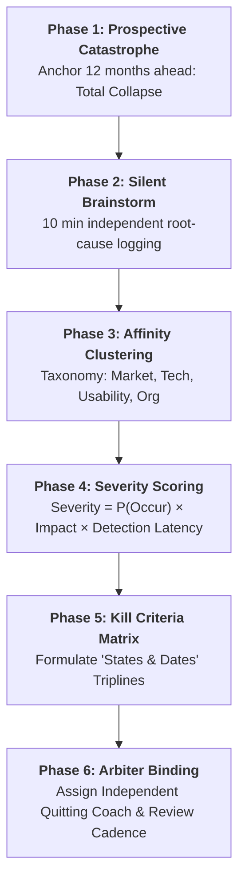
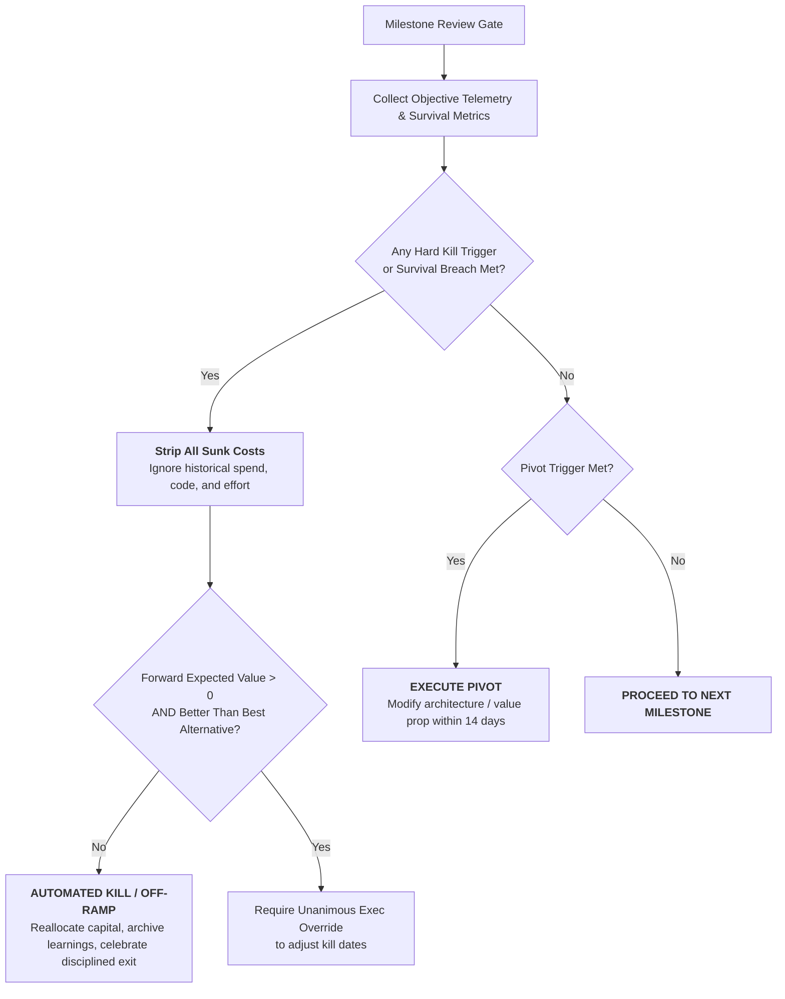

# Premortem & Kill Criteria Technical Reference Manual

A comprehensive engineering and product strategy guide for prospective failure analysis, objective kill criteria engineering, and cognitive de-biasing.

---

## 1. Theoretical Foundations

### 1.1 Prospective Hindsight (Gary Klein & Daniel Kahneman)
Standard risk analysis asks: *"What could go wrong?"* This triggers defensive cognition, social compliance, and optimism bias. Prospective hindsight asks: *"It is one year in the future, and this project has completely failed. What happened?"*
- Research demonstrates a **30% increase** in the identification of root causes when using prospective hindsight over standard forecasting.
- Eliminates the social penalty of being perceived as "not a team player" by legitimizing criticism as an analytical assignment.

### 1.2 Decision Science & Quitting Thresholds (Annie Duke)
In *Thinking in Bets* and *Quit: The Power of Knowing When to Walk Away*, Annie Duke highlights that:
- Human cognition is asymmetric: We view quitting as failure and persevering as virtue, even when expected value $\mathbb{E}[V] < 0$.
- **Escalation of Commitment:** Sunk costs (capital, time, public reputation) cause decision-makers to double down on failing courses of action.
- **States and Dates:** Kill criteria must be established before committing capital. A kill criterion specifies a measurable state observed by a specific date.
- **The Quitting Coach:** An independent third party who has no skin in the project must hold the veto or enforcement authority over kill triggers.

### 1.3 Survival Metrics Framework (Adam Thomas)
Adam Thomas formulated Survival Metrics to diagnose initiative health in high-uncertainty environments:
1. **Fast (Learning Velocity):** How quickly does the team generate validated hypotheses?
2. **Focus (Resource Concentration):** Is the team allocating $\ge 75\%$ of capacity to the core strategic hypothesis, or is capacity leaking into unplanned collateral work?
3. **Safe (Blast Radius & Psychological Freedom):** Can the team halt execution or pivot without organizational reprisal?

### 1.4 The SPADE Framework (Gokul Rajaram)
Gokul Rajaram's SPADE model establishes decision clarity for complex product initiatives:
- **Setting:** Precise context, constraints, and why the decision is happening now.
- **People:** 
  - *Decider:* Exactly one person who makes the final call.
  - *Approver:* Person with veto power (e.g., CEO/VP).
  - *Consulted:* Cross-functional peers providing input.
- **Alternatives:** 3+ distinct, mutually exclusive strategic pathways.
- **Decide:** Objective scoring against explicit criteria.
- **Explain:** Written dissemination and pre-mortem alignment.

---

## 2. Architecture & Decision Workflows

### 2.1 Premortem Facilitation & Synthesis Flow



### 2.2 Sunk Cost Circuit Breaker Decision Flow



---

## 3. Framework Matrices & Standards

### 3.1 Failure Mode Severity Matrix

$$\text{Severity Index} = \text{Probability } (1\text{--}5) \times \text{Impact } (1\text{--}5) \times \text{Detection Latency } (1\text{--}5)$$

| Severity Tier | Score Range | Mandatory Operational Action |
| :--- | :--- | :--- |
| **Tier 1: Catastrophic** | $50\text{--}125$ | Formulate non-negotiable **Hard Kill Criterion** with automated tripwire. |
| **Tier 2: Major Risk** | $25\text{--}49$ | Formulate **Pivot Trigger** and continuous leading telemetry. |
| **Tier 3: Moderate Risk** | $10\text{--}24$ | Establish **Downscope Trigger** and mitigation sprint ticket. |
| **Tier 4: Low Risk** | $< 10$ | Log in watch list; monitor during standard monthly reviews. |

### 3.2 The Master Kill Criteria Taxonomy ("States & Dates")

| Dimension | Leading Indicator (State $X$) | Milestone / Date ($Y$) | Mandated Action ($Z$) | Verification Source |
| :--- | :--- | :--- | :--- | :--- |
| **Customer Value** | Day-7 Retention $< 25\%$ among High-Expectation Customers (HXC). | Day 45 Post-Beta Launch | **Hard Kill:** Halt product line and revert to core offering. | Segment / Amplitude Telemetry |
| **Market / WTP** | Enterprise Pilot Conversion $< 15\%$ at targeted \$50k ACV. | End of Quarter 2 | **Pivot:** Shift packaging to usage-based pricing or lower tier. | Salesforce CRM Pipeline |
| **Technical Latency** | P99 API Latency $> 850\text{ms}$ under $10\text{k}$ concurrent requests. | Week 6 Benchmark Spike | **Pivot:** Re-architect data pipeline from OLTP to streaming bus. | Datadog APM Dashboards |
| **Distribution / CAC** | Blended CAC $> \$450$ with CAC Payback $> 18\text{ months}$. | Month 3 Marketing Spend | **Hard Kill:** Terminate paid channel; limit to organic word-of-mouth. | Stripe / Billing Ledger |
| **Org Capacity (Focus)** | Dedicated team spending $> 40\%$ time on unplanned legacy bugs. | Sprint 4 Retro | **Downscope:** Freeze secondary features until tech debt is cleared. | Jira Sprint Burndown |

### 3.3 Adam Thomas Survival Metrics Scorecard

```
  SURVIVAL METRICS TRINITY
         [FAST]
        /      \
       /        \
  [FOCUS]------[SAFE]
```

| Metric Dimension | Healthy Threshold | Warning Threshold | Breached (Trigger Kill Gate) |
| :--- | :--- | :--- | :--- |
| **Fast** (Hypothesis Velocity) | $\le 10$ days per test cycle | $11\text{--}21$ days | $> 21$ days without empirical signal |
| **Focus** (Capacity Allocation) | $\ge 80\%$ time on core problem | $60\text{--}79\%$ on core problem | $< 60\%$ (initiative suffering starvation) |
| **Safe** (Psychological & Blast) | 0 existential risks; blameless retro | Minor operational debt | Security vulnerability or reprisal fear |

---

## 4. Anti-Pattern Catalog & Prescriptive Repairs

### 4.1 Anti-Pattern 1: The Zombie Project (Goalpost Shifting)
- **Symptom:** As negative validation data comes in, the product team continually redefines the success metric (e.g., from "Revenue at Month 6" to "Brand Awareness" to "Strategic Learnings").
- **Root Cause:** Sunk cost fallacy combined with career protectionism and lack of an independent arbiter.
- **Prescriptive Repair:** Bind the initiative to immutable, written pre-commitments. If a date passes without meeting the state, the project automatically terminates unless an executive escalation committee unanimously overrides it with fresh budget.

### 4.2 Anti-Pattern 2: The Soft / Vague Kill Trigger
- **Symptom:** Kill criteria written as: *"If users don't seem engaged"* or *"If engineering runs into significant hurdles."*
- **Root Cause:** Fear of accountability and discomfort with binary decision boundaries.
- **Prescriptive Repair:** Enforce strict mathematical formulation:
  $$\text{IF } [\text{Metric } M < \text{Threshold } T] \text{ at } [\text{Timestamp } D], \text{ THEN } [\text{Action } A].$$

### 4.3 Anti-Pattern 3: The Sunk Cost Escalation Trap
- **Symptom:** Executive remarks: *"We've already spent \$3M and 9 months building this platform, we can't afford to stop now!"*
- **Root Cause:** Prospect Theory (loss aversion) and the endowment effect.
- **Prescriptive Repair:** Run the **Zero-Base Replacement Audit**: *"If we inherited this company today with \$0 spent on this project, would we allocate our next \$1M to this initiative or to another opportunity?"* If no, kill immediately.

### 4.4 Anti-Pattern 4: Self-Evaluating Deciders (Lack of Quitting Coach)
- **Symptom:** The Project Lead who conceived the feature is the sole evaluator of whether the kill criteria have been triggered.
- **Root Cause:** Structural conflict of interest.
- **Prescriptive Repair:** Appoint a **Neutral Quitting Coach** (e.g., Head of Finance, Staff Architect from another division, or Head of Product Ops) who chairs the milestone review.

---

## 5. Standard Operating Artifacts & Prompts

### 5.1 Premortem Workshop Facilitation Script
1. **Context Setting (5 mins):** Introduce the prospective disaster. Emphasize that finding failure modes is the highest-value contribution.
2. **Individual Ideation (10 mins):** Each engineer, designer, and PM writes 3–5 catastrophic failure narratives in silence.
3. **Round-Robin Reading (20 mins):** Share all failure items without debate. Group into affinity clusters.
4. **Scoring & Triaging (15 mins):** Score by probability, impact, and detection lag. Select top 3–5 risks.
5. **Kill Criteria Drafting (20 mins):** Write "States & Dates" contracts for each top risk. Assign the Quitting Coach.

### 5.2 The Kill Criteria Contract Template
```markdown
# Initiative Kill Criteria Contract: [Project Name]

- **Project Lead:** [Name]
- **Independent Quitting Coach:** [Name / Role]
- **Contract Date:** [YYYY-MM-DD]
- **Target Launch Date:** [YYYY-MM-DD]

## Pre-Committed Kill Gates

| Gate ID | Condition (State X) | Target Date (Y) | Action (Kill/Pivot/Downscope) | Telemetry Source |
| :--- | :--- | :--- | :--- | :--- |
| KG-01 | Day-7 Retention < 20% | 2026-11-15 | HARD KILL: Sunset beta | Mixpanel cohort query #412 |
| KG-02 | Infrastructure Cost > $0.40/user | 2026-10-31 | PIVOT: Refactor worker nodes | AWS Cost Explorer |
| KG-03 | SPADE alignment < 80% | 2026-09-30 | DOWNSCOPE: Drop multi-tenant v2 | Team Survey |

## Escalation Governance
Overriding any gate requires unanimous sign-off from:
1. Product Lead
2. Engineering Lead
3. Independent Quitting Coach
4. Executive Sponsor
```
