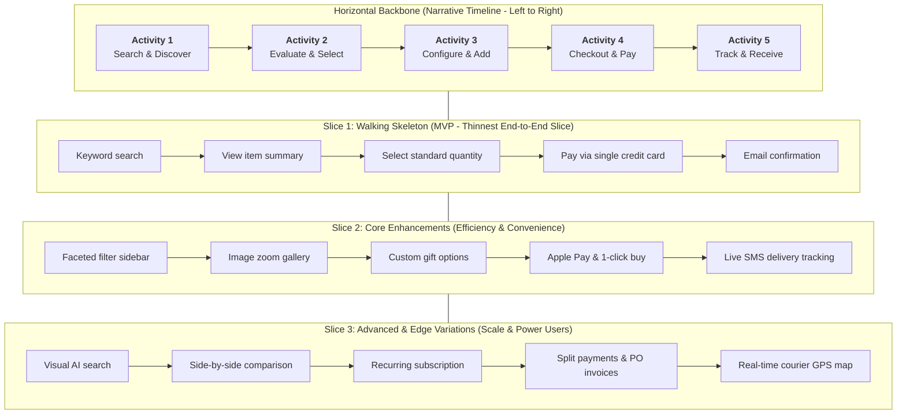

# User Story Mapping & Incremental Release Slicing Framework

## 1. The 2-Dimensional Story Map Anatomy

Developed by **Jeff Patton** (*User Story Mapping*) with foundational roots in **Alistair Cockburn's** and **Edo van Royen's** work on Walking Skeletons, User Story Mapping organizes a product backlog into a two-dimensional grid:
- **Horizontal Axis (Narrative Flow / Timeline)**: Left-to-right chronological user journey across high-level **Activities** and **User Tasks**.
- **Vertical Axis (Depth / Criticality / Release Slices)**: Top-to-bottom prioritization from the thinnest viable path (**Walking Skeleton**) down to advanced variations, optimizations, and edge cases.



---

## 2. The 3-Tier Story Mapping Hierarchy

| Level | Definition | Scope & Grain | Concrete Example |
| :--- | :--- | :--- | :--- |
| **1. User Activity (Backbone)** | High-level step in the customer's journey. Aggregates multiple tasks into a coherent phase. | Epic / Theme level | *"Manage Subscription & Billing"* |
| **2. User Task (Step)** | An action the user performs to complete the activity. Represents essential touchpoints. | Story level | *"Update Payment Method"* |
| **3. Sub-Task / Story Variation** | Specific implementation alternative, UI detail, edge case, or enhancement. | Task / Acceptance criteria level | - *Option A: Update via Stripe Credit Card Form*<br/>- *Option B: Connect PayPal account*<br/>- *Option C: Set backup fallback card* |

---

## 3. Walking Skeleton vs. Traditional Layered Slicing

A **Walking Skeleton** is the thinnest possible implementation that performs an end-to-end user transaction through every architectural tier (UI, API, DB, 3rd-party).

```
TRADITIONAL HORIZONTAL COMPONENT SLICING (BROKEN - NO USER VALUE DELIVERED)
┌──────────────────────────────────────────────────────────────┐
│ Release 1: Build 100% of Database Schemas                   │ ──> User gets 0 value
├──────────────────────────────────────────────────────────────┤
│ Release 2: Build 100% of Backend API Services               │ ──> User gets 0 value
├──────────────────────────────────────────────────────────────┤
│ Release 3: Build 100% of Frontend UI Views                  │ ──> User finally tests after 6 months
└──────────────────────────────────────────────────────────────┘

USER STORY MAP HORIZONTAL SLICING (TRACER-BULLET - USER VALUE EVERY RELEASE)
┌──────────────────────────────────────────────────────────────┐
│ Slice 1: Walking Skeleton (Thinnest End-to-End Working Flow) │ ──> Full working journey tested in Week 2
├──────────────────────────────────────────────────────────────┤
│ Slice 2: Enhanced Ergonomics & Secondary Payment Options     │ ──> Delighter & conversion lift
├──────────────────────────────────────────────────────────────┤
│ Slice 3: Power User Features & Enterprise Invoicing          │ ──> High-tier market expansion
└──────────────────────────────────────────────────────────────┘
```

| Aspect | Horizontal Component Slicing (Anti-Pattern) | Story Map Release Slicing (Walking Skeleton) |
| :--- | :--- | :--- |
| **Structure** | Slices by technical layer (DB, Backend, Frontend). | Slices horizontally across the entire user journey. |
| **Integration** | Delayed until the very end; high risk of integration shock. | Continuous from Day 1; systems integrated immediately. |
| **Feedback Loop** | Users cannot interact until all layers are finished. | Users and stakeholders test a working flow in Slice 1. |
| **Risk Profile** | High risk of building unused backend endpoints. | Lean; only build backend endpoints required by active slices. |

---

## 4. Constructing the 2D Story Map Matrix: Complete Example

### Scenario: Cloud Incident Management Platform

| User Activities $\rightarrow$ | 1. Ingest & Alert | 2. Triage & Assign | 3. Investigate & Diagnose | 4. Mitigate & Resolve | 5. Post-Mortem & Review |
| :--- | :--- | :--- | :--- | :--- | :--- |
| **Slice 1: Walking Skeleton (MVP)** | Ingest webhook from Datadog; fire SMS to on-call engineer. | Acknowledge alert via 1-click SMS link; auto-assign to responder. | View raw alert payload and timestamp in clean web log viewer. | Click "Resolve Incident" button; record resolution timestamp. | Auto-generate Markdown incident timeline with timestamps. |
| **Slice 2: Core Enhancements** | PagerDuty, OpsGenie, and Slack webhook multi-ingress. | Slack interactive button triage (`/incident claim`); escalation policies. | Correlate service metrics and trace latency graphs directly in modal. | Run automated rollback runbook script from incident room. | Collaborative rich-text post-mortem editor with action item tracking. |
| **Slice 3: Advanced & Scale** | AI deduplication & anomaly clustering across microservices. | Skill-based automated routing with timezone-aware rotations. | Automated root-cause correlation via distributed OpenTelemetry tracing. | Multi-cloud traffic reroute via automated DNS failover script. | AI executive summary generator with Jira ticket auto-creation. |

---

## 5. Walking the Map: Verification Protocol

Before finalizing any release slice, "walk the map" left to right:
1. **The Coffee Test**: Can a user sit down with a cup of coffee, start at Activity 1, progress through each subsequent activity, and achieve their goal in Slice 1 without hitting a dead end?
2. **The Dependency Check**: Does any step in Slice $N$ depend on a capability only present in Slice $N+1$? If so, pull the prerequisite up or push the dependent down.
3. **The Goldilocks Calibration**: Is Slice 1 too heavy (attempting full perfection) or too thin (broken/unusable)? It must be a functional Walking Skeleton.

---

## 6. Anti-Patterns & Systematic Repairs

| Anti-Pattern | Manifestation | Root Cause | Systematic Repair |
| :--- | :--- | :--- | :--- |
| **The Flat Backlog Abyss** | 300 Jira tickets ranked 1 to 300 without narrative context or journey awareness. | Managing backlog in a 1-dimensional list tool. | Re-map tickets onto a 2D Story Map board organized by User Activities and Tasks. |
| **The Incomplete Skeleton** | Slice 1 builds great Search and Cart features, but leaves out Checkout and Confirmation. | Misunderstanding MVP as "half of a finished car" instead of a "skateboard". | Mandate that Slice 1 must touch every activity from the first step to the final outcome. |
| **The Infinite MVP** | Slice 1 includes 5 payment methods, 3 export formats, and custom themes. | Stakeholder fear that Slice 2 will never get funded. | Enforce strict release slicing: Slice 1 is single-path only; all variations move to Slice 2/3. |
| **Story Map as Static Spec** | Map is created once in Miro/Figma, never updated, and forgotten during sprints. | Treating story mapping as a kickoff document rather than an active collaboration artifact. | Use the story map during sprint refinement and review to track slice progress and adjust scope. |
| **Horizontal Architecture Silos** | Sprint 1 is pure database tables, Sprint 2 is pure API controllers, Sprint 3 is UI. | Engineering organizing by technical layer rather than user-observable slices. | Convert stories into tracer-bullet vertical slices (DB + API + UI + Tests) spanning each release slice. |
