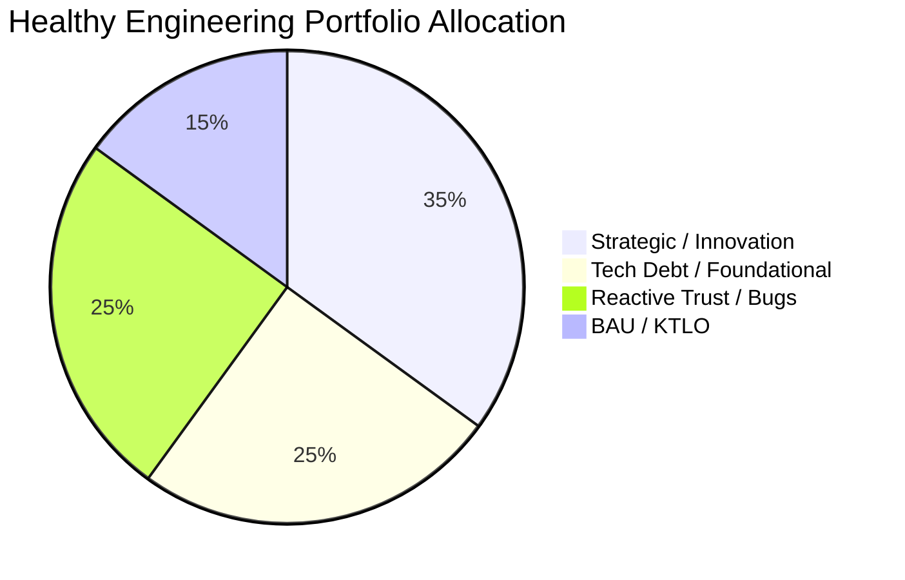

# Portfolio Resource Allocation & Software Capitalization Framework

## 1. The Athenahealth Categories of Work Model

Software development investments are classified into four distinct categories to ensure both strategic alignment and accounting compliance (US GAAP ASC 350-40):

```
┌─────────────────────────────────────────────────────────────────────────────┐
│                          CATEGORIES OF WORK                                 │
├──────────────────────────────┬──────────────────────────────────────────────┤
│ CAPITALIZE (Balance Sheet)   │ EXPENSE (P&L Operating Expense)              │
├──────────────────────────────┼──────────────────────────────────────────────┤
│ • New Feature Development:   │ • Reactive Trust / Bugs:                     │
│   Direct functionality for   │   Defect resolution, patch fixes, and        │
│   end users.                 │   routine triage.                            │
│                              │                                              │
│ • Foundational Tech:         │ • Experimental Investments:                  │
│   Core architectural blocks  │   Discovery sprints, feasibility spikes, and │
│   enabling future features   │   determining viability before commitment.   │
│   (capitalizable if new      │                                              │
│   functionality results).    │ • Maintenance & KTLO:                        │
│                              │   Infrastructure upkeep, server patches.     │
└──────────────────────────────┴──────────────────────────────────────────────┘
```

---

## 2. Capitalization Calculation Methodology

### The Capitalization Formula:
$$	ext{Project Labor Cost} = rac{	ext{Team Burdened Monthly Cost}}{	ext{Number of Projects}} 	imes 	ext{Project Allocation \%}$$

$$	ext{Final Capitalized Amount} = 	ext{Project Labor Cost} 	imes (1 - 	ext{Maintenance \%}) \quad [	ext{if Capitalizable = Yes}]$$

### Calculation Example:
* Team A: 10 Engineers @ $10,000/month = **$100,000 Total Monthly Cost**.
* Worked on 4 equal projects ($25,000 per project).
* Team spends **50% of time on maintenance**.

| Project | Allocated Cost | Capitalizable? | Cap Amount | Maintenance % | Final Capitalized Amount |
| :--- | :--- | :---: | :--- | :---: | :--- |
| **Project 1 (New Feature)** | $25,000 | Yes | $25,000 | 50% | **$12,500** |
| **Project 2 (Platform V2)** | $25,000 | Yes | $25,000 | 50% | **$12,500** |
| **Project 3 (Bug Blitz)** | $25,000 | No | $0 | 50% | **$0** |
| **Project 4 (Infra KTLO)** | $25,000 | No | $0 | 50% | **$0** |
| **TOTAL** | **$100,000** | — | — | — | **$25,000 Capitalized (25%)** |

---

## 3. Portfolio Allocation Balancing Targets



* **If Tech Debt > 40%**: System stability is degrading; requires dedicated refactoring sprints.
* **If Innovation < 20%**: Company is in the Build Trap, spending all cycles on maintenance.
