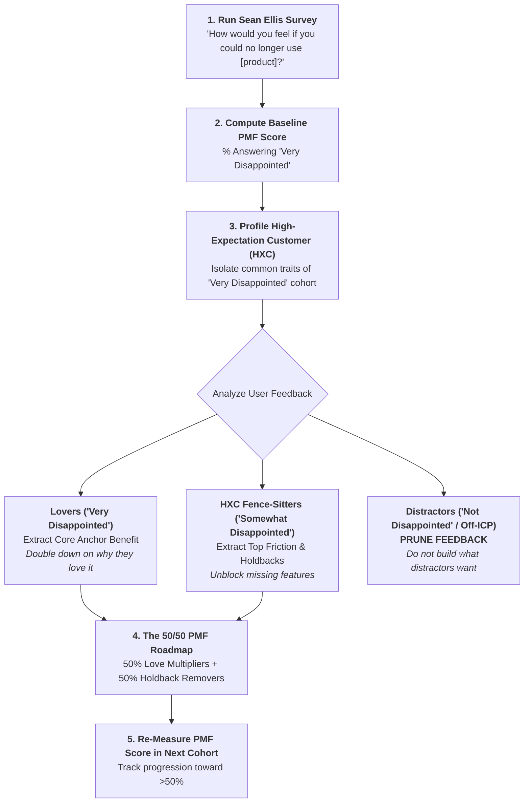
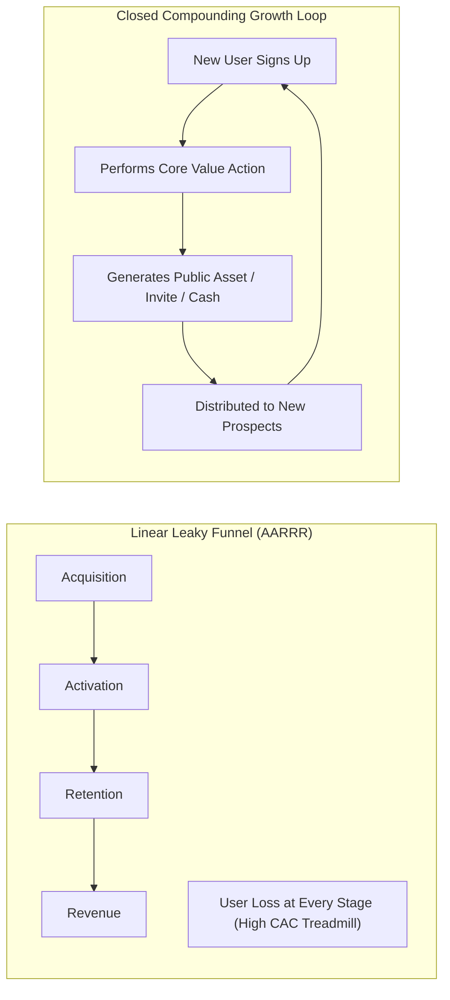

# Product-Market Fit Engine & Growth Loops Reference Manual

A comprehensive engineering and product strategy guide for measuring quantitative PMF (Superhuman Engine) and architecting compounding, self-sustaining growth loops (Reforge).

---

## 1. Theoretical Foundations

### 1.1 The Superhuman Product-Market Fit Engine (Rahul Vohra)
Rahul Vohra (Founder/CEO of Superhuman) operationalized Sean Ellis's qualitative rule-of-thumb into an algorithmic engineering methodology:
- **The Sean Ellis Benchmark:** Survey active users: *"How would you feel if you could no longer use [Product]?"*
  - *Very disappointed* (Must be $\ge 40\%$ for sustainable breakout growth).
  - *Somewhat disappointed*
  - *Not disappointed*
- **The High-Expectation Customer (HXC):** The most discerning customer persona who understands the core value proposition instantly and whose high standards push product excellence.
- **The 4-Step PMF Optimization Algorithm:**
  1. **Segment to identify the HXC:** Look at "Very Disappointed" users. Profile their roles and companies. Filter out "Somewhat Disappointed" users whose use case does not fit this profile.
  2. **Analyze feedback to convert fence-sitters:** Find out why "Very Disappointed" users love the product (the Anchor Benefit). Ask "Somewhat Disappointed" users (who value that same benefit) what holds them back.
  3. **Discard non-HXC feedback:** Actively ignore complaints and feature requests from users who answered "Not Disappointed" or "Somewhat Disappointed" for reasons outside the core value proposition.
  4. **The 50/50 Roadmap:** Dedicate 50% of roadmap bandwidth to doubling down on what lovers love, and 50% to removing the top holdbacks of HXC fence-sitters.

### 1.2 Growth Loops vs. Linear Funnels (Brian Balfour & Andrew Chen)
Traditional product marketing relies on linear "Pirate Funnels" (AARRR: Acquisition $\to$ Activation $\to$ Retention $\to$ Referral $\to$ Revenue):
- **Why Funnels Fail:** Funnels are non-reinvesting straight lines. They create a "paid acquisition treadmill" where every incremental user requires incremental capital or sales force. CAC predictably increases as channels saturate.
- **Why Loops Compound:** Growth Loops are closed systems where the output of one user's action serves as the direct input for the next cycle.

$$\text{Cohort } N \xrightarrow{\text{Action}} \text{Output (Content, Invites, Revenue)} \xrightarrow{\text{Reinvestment}} \text{Cohort } N+1$$

### 1.3 Quantitative Loop Calculus

1. **Viral Coefficient ($K$-Factor):**
   $$K = i \times c$$
   Where $i$ is the number of invitations/shares sent per user, and $c$ is the conversion rate of recipient to active user. If $K > 1$, exponential viral growth occurs. Even if $K < 1$ (e.g., $K = 0.4$), the loop acts as a powerful acquisition multiplier on organic and paid traffic.
2. **Loop Cycle Time ($T$):**
   The time required for an activated user to generate an output that acquires and activates the next user. Compounding growth is exponentially sensitive to $T$:
   $$\text{Compounded Growth} \propto K^{t / T}$$
3. **Retention Asymptote ($R_{\infty}$):**
   The percentage of a user cohort that remains active indefinitely. Growth loops cannot compound on a leaky bucket; the cohort curve must flatten parallel to the x-axis ($R_{\infty} > 0$).

---

## 2. Architecture & Decision Workflows

### 2.1 The Rahul Vohra 4-Step PMF Optimization Engine

### 2.2 Growth Loop System Architecture vs. Linear Funnel

---

## 3. Framework Matrices & Standards

### 3.1 The 4-Question Superhuman PMF Survey

| Question | Analytical Objective | Actionable Decision Rule |
| :--- | :--- | :--- |
| **1. How would you feel if you could no longer use [Product]?** *(Very / Somewhat / Not disappointed)* | Benchmark PMF against the 40% threshold. | If $< 40\%$, do not scale marketing; execute HXC segmentation immediately. |
| **2. What type of people do you think would most benefit from [Product]?** | Uncover the customer's mental model and authentic language for the HXC. | Use verbatim language for landing page hero copy and targeting criteria. |
| **3. What is the main benefit you receive from [Product]?** | Identify the singular "Anchor Value" that creates intense delight. | Protect and strengthen this feature above all else; never dilute it. |
| **4. How can we improve [Product] for you?** | Diagnose the critical holdbacks of HXC fence-sitters. | Filter only for respondents who value the Anchor Benefit; add top blockers to the 50% roadmap. |

### 3.2 Master Growth Loop Typology Matrix

| Loop Archetype | Input Trigger | User Core Action | Asset / Output Created | Reinvestment & Distribution Vector | Example |
| :--- | :--- | :--- | :--- | :--- | :--- |
| **Collaborative Viral Loop** | User creates project workspace. | Invites colleagues to review, edit, or comment. | Collaboration invite / notification email. | Recipient joins workspace and invites other teams. | Figma, Slack, Notion |
| **Organic Content / SEO Loop** | User creates public artifact (doc, board, website). | Publishes or embeds artifact on public web. | High-quality, search-indexed URL. | Search engines index page; external searchers discover and sign up. | Pinterest, GitHub, StackOverflow |
| **User-Generated Network Loop** | User submits job listing, listing, or marketplace offer. | Transacts with buyer/applicant. | Public marketplace liquidity and social proof. | Marketplace attracts more buyers, which attracts more sellers. | Airbnb, Uber, Substack |
| **Paid Reinvestment Loop** | User converts to paid subscription. | Generates high gross margin cash flow. | Free cash flow / customer LTV. | Cash reinvested into paid acquisition with $< 12$-mo payback. | Superhuman, Dropbox, Shopify |

### 3.3 The 50/50 PMF Roadmap Allocation Model

| Allocation Track (50%) | Target Focus | Typical Engineering Epics | Desired Impact |
| :--- | :--- | :--- | :--- |
| **Track A: Love Multipliers (50%)** | Deepen the core anchor value that "Very Disappointed" users adore. | - Performance & speed optimization (e.g., sub-100ms UI). - Advanced power-user keyboard shortcuts. - Rich AI workflow automation. | Raises NPS, drives organic word-of-mouth $K$-factor, increases retention. |
| **Track B: Holdback Removers (50%)** | Remove table-stakes blockers for high-potential fence-sitters. | - Mobile companion app parity. - Offline sync mode. - Key enterprise integration (e.g., Google Calendar, Salesforce). | Converts "Somewhat Disappointed" users into "Very Disappointed" champions. |

---

## 4. Anti-Pattern Catalog & Prescriptive Repairs

### 4.1 Anti-Pattern 1: Listening to Non-HXC Users (The Dilution Trap)
- **Symptom:** Product team attempts to satisfy feedback from users who answered "Not Disappointed" or "Somewhat Disappointed" for unaligned use cases, bloating the product with confusing features.
- **Root Cause:** Inability to say "no" and treating all user feedback as equally valuable.
- **Prescriptive Repair:** Ruthlessly delete all survey responses from users who answered "Not Disappointed". Only build for "Very Disappointed" users and the fence-sitters who already value your core anchor benefit.

### 4.2 Anti-Pattern 2: Premature Scaling of Paid Acquisition
- **Symptom:** Spending \$100k/month on Facebook/Google Ads when the Sean Ellis PMF score is at 18%.
- **Root Cause:** Executive pressure for vanity top-line growth.
- **Prescriptive Repair:** Freeze all paid acquisition spend until the HXC PMF score crosses $\ge 40\%$ and cohort retention reaches a horizontal asymptote ($R_{\infty} > 25\%$).

### 4.3 Anti-Pattern 3: The Funnel-Only Paid Treadmill
- **Symptom:** Growth team constantly searches for new ad channels as CAC doubles, without building any native product loops.
- **Root Cause:** Treating growth as a marketing department function rather than a product architectural property.
- **Prescriptive Repair:** Re-architect the core user workflow to output public artifacts, viral invites, or automated collaboration triggers.

---

## 5. Quantitative Formulas & Loop Telemetry

### 5.1 Loop Growth Compounding Equation
$$\text{Total Users at Time } t = U_0 \times \sum_{n=0}^{\lfloor t/T \rfloor} K^n$$

Where:
- $U_0$ = Initial seed cohort size.
- $K$ = Viral / Reinvestment coefficient ($i \times c$).
- $T$ = Cycle time per loop iteration.
- $t$ = Total elapsed time.

### 5.2 Cycle Time Reduction Sensitivity Table
Assuming $U_0 = 1,000$ and $K = 0.8$:

| Loop Cycle Time ($T$) | Active Users at Day 60 | Active Users at Day 120 |
| :--- | :--- | :--- |
| **30 Days ($T=30$)** | $2,440$ | $3,361$ |
| **14 Days ($T=14$)** | $4,213$ | $4,982$ |
| **3 Days ($T=3$)** | $4,999$ | $5,000$ (Near theoretical asymptote in $<15$ days) |
