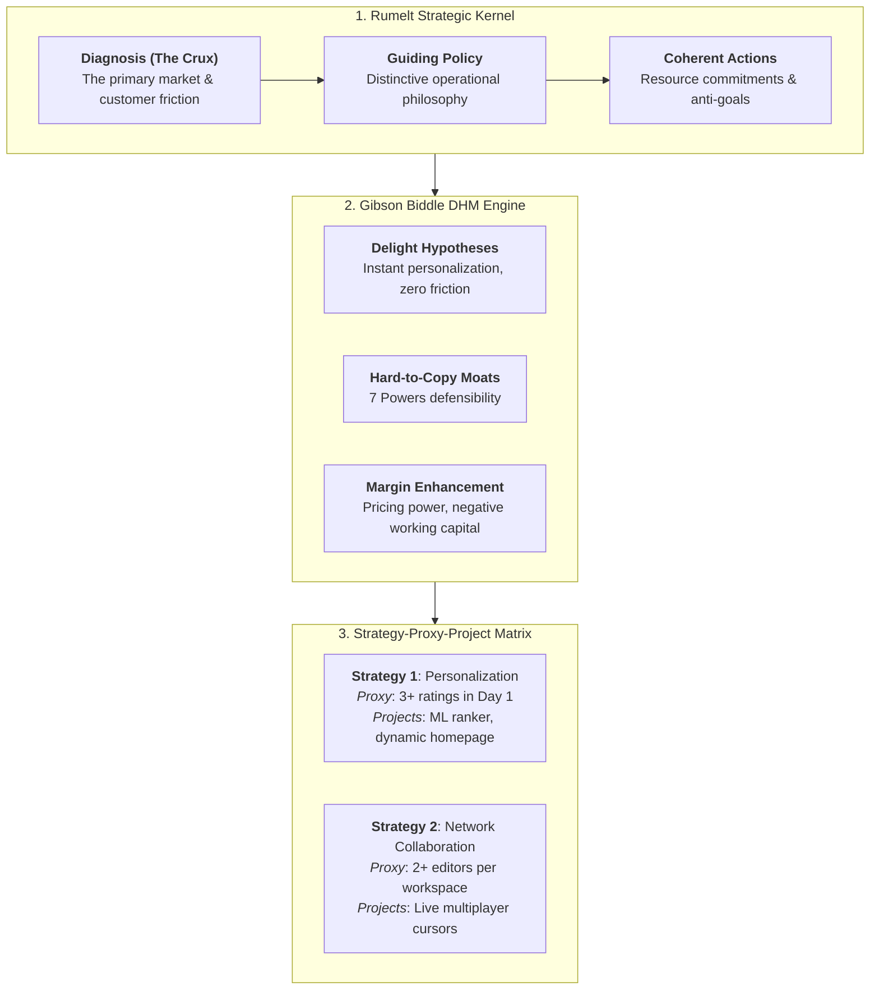
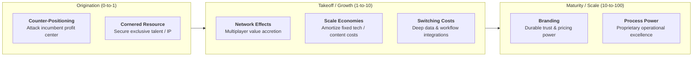

# Product Strategy Narrative & Moat Architecture Reference Manual

A comprehensive engineering and product strategy guide for formulating durable business moats, DHM customer value engines, and leading proxy metric architectures.

---

## 1. Theoretical Foundations

### 1.1 The DHM Model (Gibson Biddle)
Gibson Biddle (former VP/CPO at Netflix and Chegg) defines product strategy as a multi-hypothesis model answering three simultaneous questions:
1. **Delight Customers:** How does the product create outsized utility, joy, and emotional resonance?
2. **Hard-to-Copy Advantage:** What structural attributes prevent well-funded competitors from cloning the value proposition?
3. **Margin-Enhancing:** How does the product generate sustainable economic profits to fund long-term innovation and R&D?

```
                      [ DELIGHT ]
                     /           \
                    /             \
       [ HARD-TO-COPY ]--------- [ MARGIN-ENHANCING ]
```

### 1.2 The GEM Framework & Proxy Metrics (Gibson Biddle)
- **GEM Prioritization:** Forces explicit executive ranking of **G**rowth (acquisition), **E**ngagement (retention), and **M**onetization (revenue/margins) for each business phase.
- **Proxy Metrics:** High-level strategic goals (e.g., "Build personalization moat") cannot be acted on in daily work. A proxy metric is a leading, high-frequency, customer-centric measurement that strongly correlates with long-term strategic success (e.g., *Netflix:* percentage of new members who rate $\ge 3$ movies in their first session).

### 1.3 The 7 Powers Framework (Hamilton Helmer)
Hamilton Helmer established the 7 fundamental economic mechanisms that generate persistent, non-arbitrageable enterprise value:

$$\text{Power} = \text{Benefit (to Customer/Company)} + \text{Barrier (Preventing Competitor Duplication)}$$

1. **Scale Economies:** Per-unit cost decreases as production scale expands (e.g., Netflix original content amortization).
2. **Network Effects:** The value of the service to any user scales with total network participation (e.g., LinkedIn, Figma multiplayer canvas).
3. **Counter-Positioning:** An upstart adopts a new, superior business model that incumbents cannot adopt due to severe collateral damage to their existing core profits (e.g., Netflix DVD subscription eliminating Blockbuster late fees; Vanguard low-cost index funds).
4. **Switching Costs:** The customer incurs unacceptable financial, procedural, or psychological costs to switch to an alternative (e.g., Salesforce CRM, AWS cloud infrastructure).
5. **Branding:** Enduring positive reputation that lowers search costs and evokes trust or social status (e.g., Apple, Tiffany & Co.).
6. **Cornered Resource:** Preferential or exclusive access to an indispensable asset that independently delivers superior returns (e.g., Pixar animation creative team, patented pharmaceutical formulas).
7. **Process Power:** Proprietary institutional routines, operational architecture, and tacit knowledge that cannot be easily reverse-engineered or hired away (e.g., Toyota Production System, TSMC semiconductor manufacturing).

### 1.4 The Kernel of Good Strategy (Richard Rumelt)
In *Good Strategy / Bad Strategy*, Richard Rumelt emphasizes that strategy is problem-solving under competitive friction:
- **Diagnosis:** A simplifying assessment that defines the nature of the challenge and separates the critical crux from trivial distractions.
- **Guiding Policy:** The chosen overall approach and operational doctrine to address the obstacles identified in the diagnosis.
- **Coherent Actions:** A set of mutually reinforcing, coordinated steps and resource allocations to execute the guiding policy.

---

## 2. Architecture & Decision Workflows

### 2.1 The Unified Product Strategy Architecture



### 2.2 Helmer 7 Powers Lifecycle Matrix



---

## 3. Framework Matrices & Standards

### 3.1 Hamilton Helmer 7 Powers Master Matrix

| Power | Benefit (What value it delivers) | Barrier (Why competitors cannot copy) | Prime Example |
| :--- | :--- | :--- | :--- |
| **Scale Economies** | Lower unit cost at high production volume. | Heavy capital barrier to match minimum efficient scale. | Netflix streaming content budget amortized over 250M+ subscribers. |
| **Network Effects** | Utility scales with each incremental network participant. | High chicken-and-egg coordination barrier for competitors. | Figma (multiplayer canvas makes single-player design tools obsolete). |
| **Counter-Positioning** | Superior customer experience or lower total price. | Incumbent faces massive revenue/profit cannibalization if they copy. | Netflix DVD subscriptions (eliminated late fees, which made up 16% of Blockbuster revenue). |
| **Switching Costs** | Predictable, frictionless continuity for customer. | Migrating data, retraining employees, and integration risk are cost-prohibitive. | Snowflake / Databricks data warehouse architectures. |
| **Branding** | Higher willingness-to-pay (WTP) and lower organic acquisition CAC. | Requires decades of consistent positive reinforcement and cultural equity. | Apple (hardware premium and privacy trust). |
| **Cornered Resource** | Superior product capabilities or cost advantage. | Legally or structurally non-replicable (patents, exclusive contracts, regulatory licenses). | OpenAI exclusive partnership with Microsoft Azure supercomputing infrastructure. |
| **Process Power** | Higher yield, faster throughput, or lower operational error rates. | Tacit, distributed organizational routines that cannot be reverse-engineered from outputs. | TSMC semiconductor fabrication yield mastery. |

### 3.2 Gibson Biddle Strategy-Proxy-Project Master Table

| Strategic Pillar | Strategic Hypothesis (DHM) | Hard-to-Copy Power | Leading Proxy Metric | Rolling Projects / Experiments |
| :--- | :--- | :--- | :--- | :--- |
| **1. Hyper-Personalization** | Delivering tailored content recommendations delights users, increases retention, and lowers discovery CAC. | Data Network Effects & Scale Economies | % of new signups who stream $\ge 2$ recommended titles in first 48 hours. | 1. Vector embedding recommendation engine.<br/>2. Dynamic home screen thumbnail generator. |
| **2. Multi-Player Collaboration** | Real-time shared workspaces turn individual design into collaborative team workflows, creating insurmountable switching friction. | Network Effects & Switching Costs | % of team workspaces with $\ge 3$ active concurrent editors per week. | 1. CRDT multiplayer synchronization engine.<br/>2. Granular role-based presence cursors. |
| **3. Enterprise Ecosystem** | Pre-built integrations and compliance security enable enterprise adoption at premium margins. | Switching Costs & Scale Economies | % of enterprise accounts with $\ge 5$ native third-party webhook integrations active. | 1. SAML SSO & SCIM auto-provisioning.<br/>2. REST Webhook event stream API. |

---

## 4. Good Strategy vs. Bad Strategy Audit Rubric

| Dimension | Bad Strategy (Fluff & Illusion) | Good Strategy (Calculated Leverage) |
| :--- | :--- | :--- |
| **Problem Definition** | Vague optimism (*"Become the #1 leader in cloud productivity"*). | Sharp diagnosis of the structural crux (*"Enterprise migration is stalled by 6-month legacy data ingestion timelines"*). |
| **Focus & Trade-offs** | Laundry list of 25 simultaneous priorities with no hard choices. | Concentrates overwhelming resource force on 2–3 decisive strategic pillars; explicit list of anti-goals. |
| **Competitive Moats** | Pure execution speed with zero structural defensibility (*"We will just outwork them"*). | Deliberately crafts one or more 7 Powers (Counter-Positioning, Switching Costs, Network Effects). |
| **Operational Metrics** | Trailing vanity metrics (Annual ARR, press mentions, total registered users). | Leading, high-frequency Proxy Metrics that give daily/weekly feedback on strategic hypotheses. |

---

## 5. Anti-Pattern Catalog & Prescriptive Repairs

### 5.1 Anti-Pattern 1: The Feature Factory Masquerading as Strategy
- **Symptom:** The product roadmap is a 50-row Gantt chart of customer feature requests without any unifying hypothesis.
- **Root Cause:** Product management mistaking operational delivery for strategic differentiation.
- **Prescriptive Repair:** Enforce the **DHM Filter**. Every major roadmap theme must explicitly state how it creates customer delight, which of the 7 Powers it builds, and how it expands business margin.

### 5.2 Anti-Pattern 2: The Slogan / Fluff Trap (Rumelt Bad Strategy)
- **Symptom:** Strategy document consists of aspirational platitudes: *"Deliver world-class experiences through AI-driven innovation."*
- **Root Cause:** Inability of leadership to make hard choices or declare what they will NOT do.
- **Prescriptive Repair:** Rewrite using the **Rumelt Kernel**:
  1. *Diagnosis:* Exactly what obstacle prevents us from growing?
  2. *Guiding Policy:* What asymmetric approach will we deploy?
  3. *Coherent Actions:* What specific projects and resource shifts will we execute?

### 5.3 Anti-Pattern 3: Trailing Metric Fixation
- **Symptom:** The strategy team only tracks quarterly ARR or annual churn, resulting in 90-day feedback delays before discovering strategy failure.
- **Root Cause:** Confusing financial outcomes with behavioral leading indicators.
- **Prescriptive Repair:** Derive high-frequency **Gibson Biddle Proxy Metrics** that measure early customer habit formation in Days 1–14.
