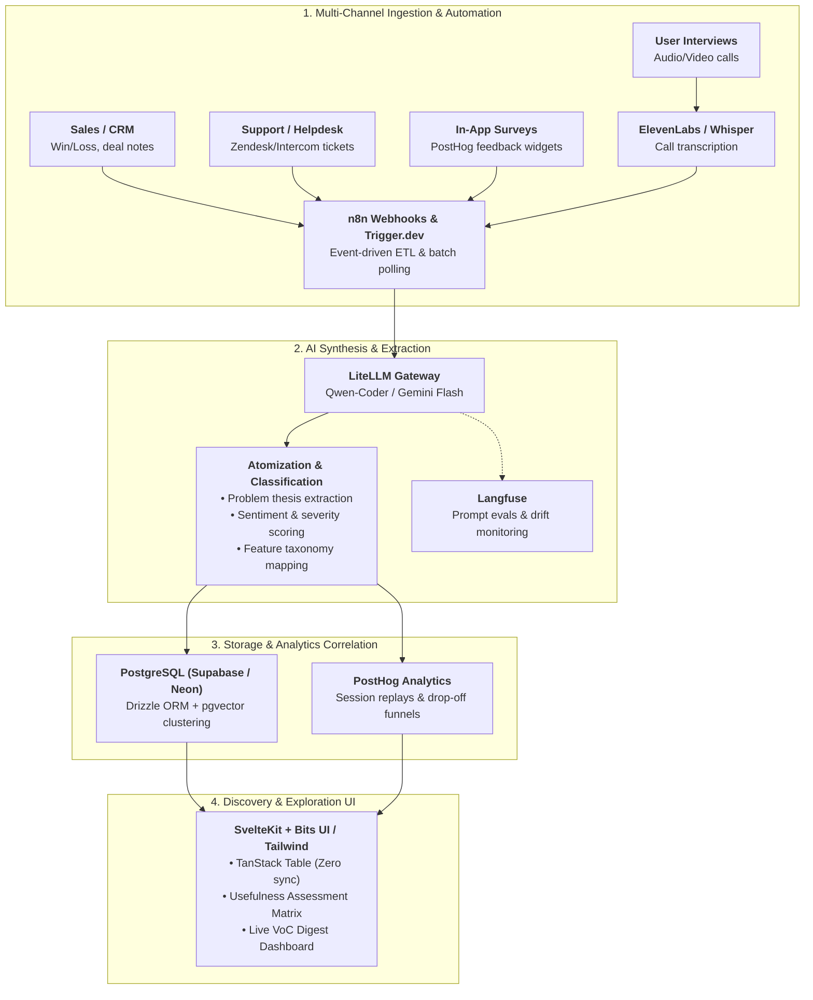

# Voice of Customer (VoC) Pipeline & ResearchOps Architecture

## 1. Technical Pipeline & Preferred Stack Integration

To avoid expensive enterprise SaaS lock-in and high cognitive friction, operationalize the VoC pipeline using the modern, OSS-first, high-velocity stack:



---

## 2. Multi-Channel Signal Ingestion Matrix

| Channel | Ingestion Tool | Data Ingested | Ingestion Cadence | Primary Signal Extracted |
| :--- | :--- | :--- | :--- | :--- |
| **Sales** | n8n $\rightarrow$ CRM | Win/Loss notes, competitor feature gaps | Real-time / Daily | Purchase blockers, missing enterprise capabilities |
| **Account Management** | n8n $\rightarrow$ CRM | Churn exit surveys, upsell blockers | Monthly | Retention risks, expansion constraints |
| **Support** | Trigger.dev $\rightarrow$ Zendesk | Bug tickets, UX confusion, workarounds | Hourly batch | Usability defects, onboarding friction points |
| **Product & UXR** | ElevenLabs $\rightarrow$ S3 | In-depth interviews, recorded tests | Weekly | Deep Jobs-to-be-Done (JTBD) needs |
| **In-App Feedback** | PostHog Surveys | Direct user feedback & satisfaction | Real-time | Feature-specific sentiment & immediate friction |

---

## 3. Data Schema & Drizzle ORM Relational Model

Define clean, typed persistence models for feedback atomization:

```typescript
// schema/voc.ts - Drizzle ORM Schema
import { pgTable, text, timestamp, uuid, integer, jsonb, vector } from 'drizzle-orm/pg-core';

export const feedbackSignals = pgTable('feedback_signals', {
  id: uuid('id').defaultRandom().primaryKey(),
  sourceChannel: text('source_channel').notNull(), // 'sales', 'support', 'uxr', 'posthog'
  customerSegment: text('customer_segment').notNull(), // 'smb', 'mid_market', 'enterprise'
  arrValue: integer('arr_value').default(0),
  rawContent: text('raw_content').notNull(),
  transcriptionId: text('transcription_id'),
  posthogSessionId: text('posthog_session_id'),
  createdAt: timestamp('created_at').defaultNow().notNull(),
});

export const problemTheses = pgTable('problem_theses', {
  id: uuid('id').defaultRandom().primaryKey(),
  title: text('title').notNull(),
  description: text('description').notNull(),
  severity: text('severity').notNull(), // 'blocker', 'high', 'medium', 'low'
  usefulnessStatus: text('usefulness_status').notNull(), // 'fully_met', 'partially_met', 'not_met'
  embedding: vector('embedding', { dimensions: 1536 }), // pgvector for deduplication
  createdAt: timestamp('created_at').defaultNow().notNull(),
});
```

---

## 4. The Usefulness Assessment Matrix (Fidelity Model)

Evaluate core user jobs across product offerings to guide roadmap prioritization:

| Ranked User Need | Product A | Product B | Product C | Synthesis & Status |
| :--- | :---: | :---: | :---: | :--- |
| *1. Real-time audit data export* | Fully Met (✓) | Not Met (✗) | Partially Met (~) | High satisfaction in core; gaps in bundle exports. |
| *2. Multi-currency invoicing* | Not Met (✗) | Not Met (✗) | Not Met (✗) | **Top driver of enterprise lost deals & churn.** |
| *3. Dynamic strategy adjustments* | Partially Met (~) | Fully Met (✓) | Not Met (✗) | Usability friction on mobile; smooth on desktop. |

* **Rating Scale**:
  - **Fully Met (✓)**: Fast, intuitive, zero workarounds required.
  - **Partially Met (~)**: Functional but high friction, confusing UX, or manual export required.
  - **Not Met (✗)**: No capability exists; customers resort to third-party tools or churn.
